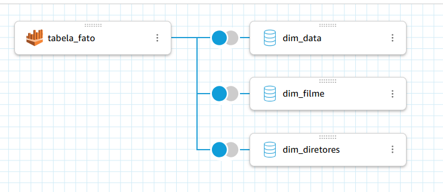
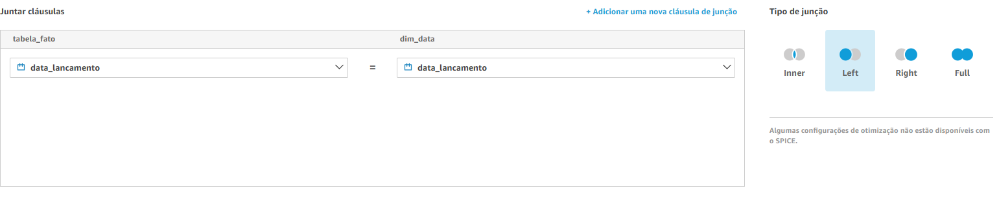
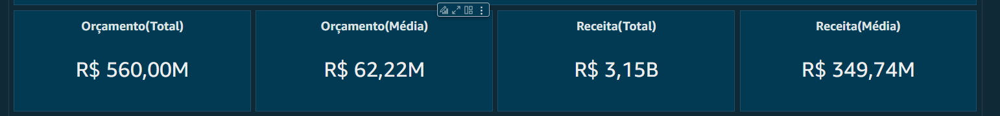
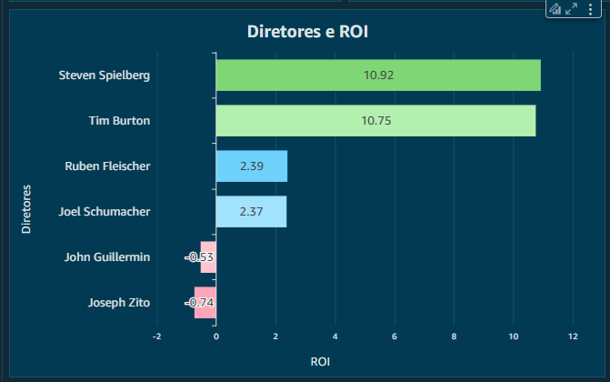
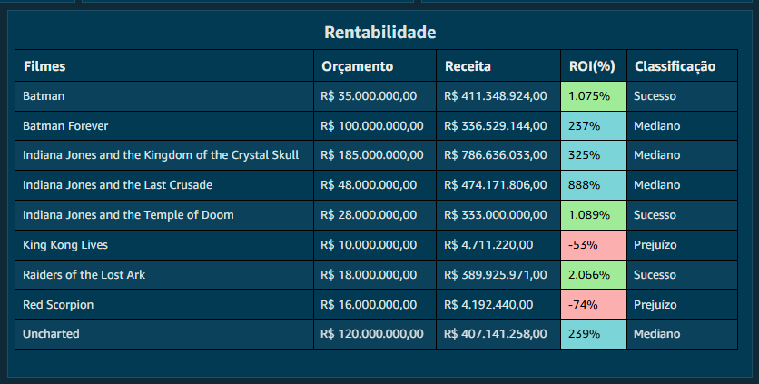
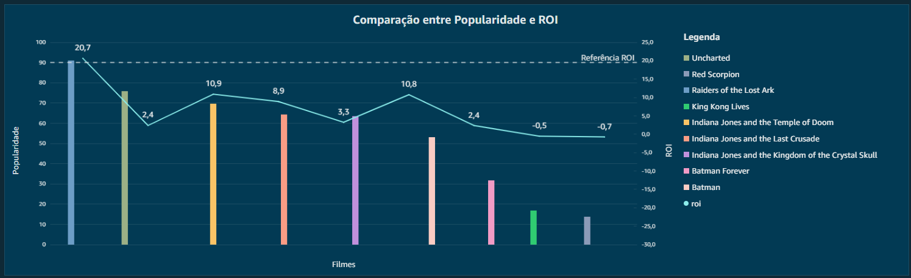
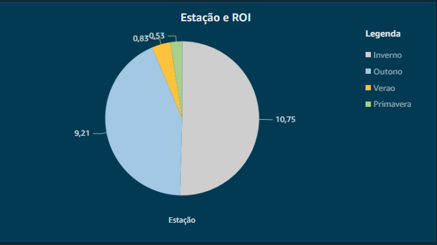
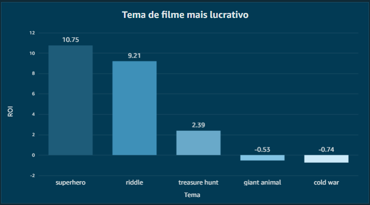
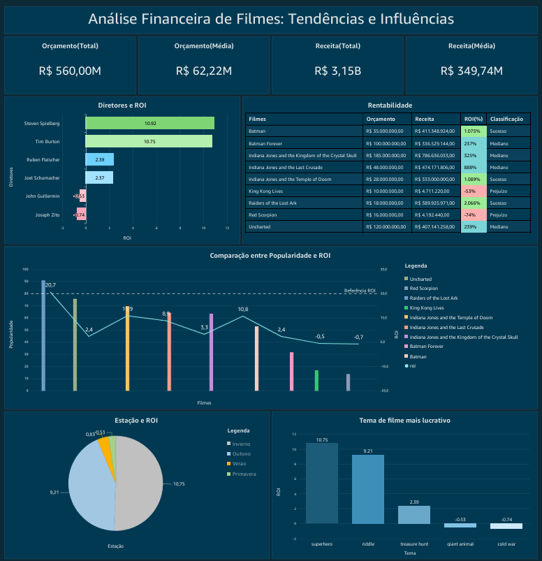

####
**Localização**: C:\Users\beatr\OneDrive\Área de Trabalho\ProgramaBolsas\Sprint10\README.md

## Informações
* Na parte **exercícios** encontrará minhas resoluções dos exercícios.
* Indo em **evidências** você consegue entender como desenvolvi o desafio do sprint.
* Em **certificados** irá encontrar quais cursos participei e conclui.

## Anotações

Nessa sprint, aprendemos sobre o serviço da AWS Quicksight, um serviço que oferece ferramentas para criação de visualizações, realizar análises e obter insights de negócios a partir de seus dados.

## Exercícios

Nessa Sprint focamos na entrega do desafio, não tendo exercícios. 

## Evidências

Evidência do relacionamento entre as tabelas.

Evidência sobre como criar o relacionamento.

Evidência dos gráficos que mostram uma visão geral dos orçamentos e receitas dos filmes analisados.

Evidência do gráfico dos diretores que mostra os diretores e a média de retorno sobre investimento (ROI) obtida pelos filmes que dirigiram.

Evidência do gráfico de rentabilidade que apresenta o orçamento, a receita e o ROI dos filmes, classificando-os em sucesso, mediano ou prejuízo.

Evidência do gráfico que mostra a comparação entre a popularidade dos filmes e suas rentabilidades, podendo analisar diferentes cenários.

Evidência sobre o gráfico de estação, onde mostra qual estação se mostrou ser melhor para lançar filmes. 

Evidência sobre o gráfico de Temas, onde foi possível analisar quais temas são melhores para os filmes serem mais rentáveis. 

Evidência mostrando o dashboard por completo.

## Certificados

Nessa sprint não tivemos cursos na plataforma da AWS.