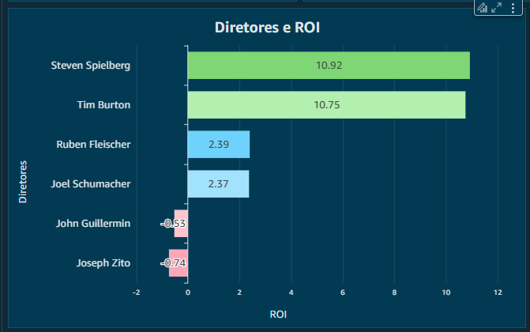
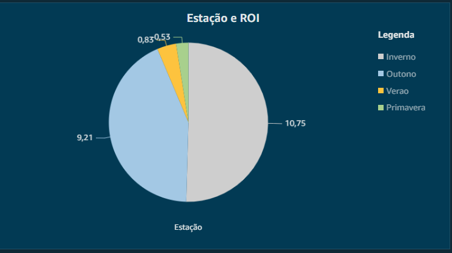

## Desafio
Aqui você encontrará o passo a passo de como solucionei o desafio da Sprint 10.

A partir da sprint 6 foi feita a entrega, por partes, do desafio final. Ou seja, o desafio final é constituído de 5 entregas. 

Primeira entrega: Nessa entrega foi feita a ingestão de arquivos csv em um Bucket do S3 na camada Raw Zone. Para isso, foi preciso criar um container que rodasse um script python. Esse script python tinha como objetivo criar um bucket e carregar os arquivos CSV para lá. Além disso, foi aqui que decidimos nossa análise.

Segunda entrega: Nessa entrega utilizamos o serviço Lambda da AWS para fazer requisições de dados na API do TMDB e salvar esses dados na camada Raw em um bucket do S3.

Terceira entrega: Nessa entrega foi feito o tratamento dos dados utilizando o serviço Glue da AWS, salvando esses dados na camada Trusted em um bucket do S3. 

Quarta entrega: Nessa entrega foi feito o refinamento dos dados, salvando os dados na camada Refined em um bucket do S3, deixando-os prontos para a parte final que é a análise dos dados e a criação do dashboard.

Quinta entrega: Entrega dessa sprint e última entrega, criação do dashboard, utilizando o serviço Quicksight da AWS.

**Localização**: C:\Users\beatr\OneDrive\Área de Trabalho\ProgramaBolsas\Sprint10\desafio\README.md

Nessa Sprint 10 foi trabalhado em cima da última entrega do desafio final, a construção de um dashboard a partir dos dados que coletamos e transformamos nas últimas sprints. 

Após criar uma conta no QuickSight, configurei meu conjunto de dados conectando-o ao Athena.

No QuickSight, após adicionar todas as tabelas necessárias ao conjunto de dados, é possível estabelecer relacionamentos entre elas.

A plataforma facilita esse processo, permitindo que o usuário selecione o tipo de join desejado e defina as colunas correspondentes para estabelecer as conexões. Um exemplo disso abaixo: 

Depois de salvar essas configurações, basta começar a criar os gráficos.
O foco central do meu dashboard é a análise dos orçamentos e receitas dos filmes. Desde o início, meu objetivo foi entender a rentabilidade dessas produções, identificando fatores que podem influenciá-la, como sazonalidade, tema e diretor. Além disso, também explorei a relação entre rentabilidade e popularidade, pois um filme pode ser lucrativo sem ser amplamente popular ou, ao contrário, alcançar grande popularidade sem gerar tanto lucro.

### Dashboard

Meu dashboard começa com uma visão geral dos orçamentos e receitas dos filmes, ou seja, o total e a média de receita e orçamento de todos os filmes que trabalhei.

O gráfico "Diretores e ROI" apresenta os diretores e a média de retorno sobre investimento (ROI) obtida pelos filmes que dirigiram. O papel do diretor é fundamental na produção cinematográfica, influenciando diretamente a rentabilidade do filme. Uma direção bem-executada é essencial para definir a visão e o sucesso da obra.

O gráfico "Rentabilidade" apresenta a relação entre o orçamento dos filmes, a receita obtida e o ROI (Retorno sobre Investimento) calculado. Com base nesse indicador, os filmes foram classificados da seguinte forma:
    ROI maior que 10: filmes considerados um grande sucesso.
    ROI entre 2 e 9: filmes lucrativos, mas com um desempenho mediano em comparação aos mais rentáveis.
    ROI menor que 2: filmes com baixo retorno, podendo até representar prejuízo.

Aqui temos um gráfico que compara a popularidade e o ROI (Retorno sobre Investimento) de diferentes filmes. Ele nos ajuda a entender como esses dois fatores se relacionam e a identificar padrões interessantes.
Com esse gráfico, conseguimos identificar diferentes cenários:
    Filmes que são populares e altamente lucrativos – esses são os verdadeiros sucessos de bilheteria.
    Filmes muito populares, mas com ROI mediano – ou seja, atraíram bastante público, mas não necessariamente geraram um grande retorno financeiro.
    Filmes com ROI positivo, mas baixa popularidade – casos em que o filme não fez muito barulho, mas foi eficiente em termos de investimento.
    Filmes impopulares e com ROI negativo – aqueles que falharam tanto em atrair público quanto em gerar lucro.

No quarto gráfico, busquei relacionar a rentabilidade dos filmes com a sazonalidade, ou seja, a época do ano em que foram lançados. A análise revelou que o inverno é a estação mais lucrativa para estreias, seguido pelo outono, depois o verão e, por último, a primavera.

O gráfico "Tema de Filme mais Lucrativo" ilustra a relação entre diversos temas de filmes e o Retorno sobre Investimento (ROI). Os principais insights revelados por esse gráfico indicam que filmes de super-heróis são uma excelente escolha, apresentando uma alta rentabilidade. Filmes de mistério/enigma também se destacam como uma boa opção para alcançar uma rentabilidade elevada. Por outro lado, filmes de caça ao tesouro e aqueles que envolvem animais gigantes apresentam os desempenhos mais baixos. Dessa forma, os dois primeiros temas demonstaram ter as maiores chances de sucesso de um filme.

O Amazon QuickSight da AWS tem vários gráficos e ferramentas para criar visualizações. Mesmo com os desafios desta sprint, essas ferramentas ajudaram bastante na hora de tirar as ideias do papel e deixar a criatividade e o raciocínio fluíssem. 

Dashboard completo: 

