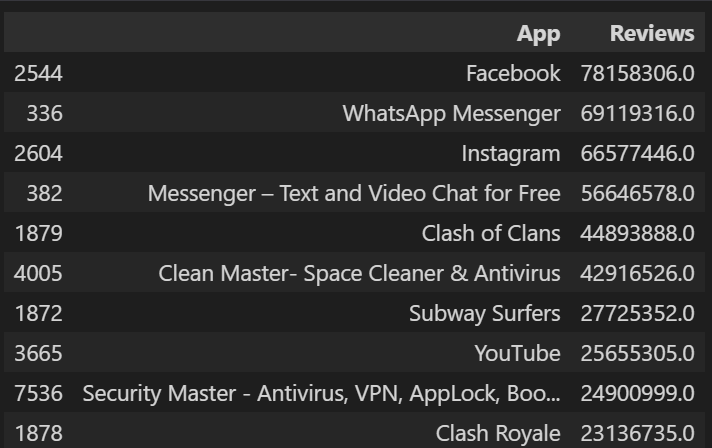

## Desafio
Aqui você encontrará o passo a passo de como solucionei o desafio do Sprint 3.

**Localização**: C:\Users\beatr\OneDrive\Área de Trabalho\ProgramaBolsas\Sprint3\desafio\README.md

#### O desafio tem como objetivo a prática de Python utilizando o Jupyter.

##### O desafio possui 8 etapas, sendo elas essenciais para poder tratar e analisar o dataset fornecido pelo desafio.

#### A primeira parte foi essencial por causa das importações das bibliotecas *pandas* e *matplotlib*, que ajudaram muito na questão de análise e criação de gráficos. Após a importação, eu carreguei os dados do dataset utilizando a biblioteca *pandas* com a função *read_csv* e, também, removi as linhas duplicadas utilizando a função *drop_duplicates*.

#### Em várias etapas serão necessário tratar os dados. Para isso eu criei a função *limpar_converter*.
##### A função é simples, como a maioria dos dados encontram-se no tipo *str*, eu utilizei o *isinstance* que verifica se o valor que estamos colocando como parâmetro é uma instância do tipo str. Caso ela seja, eu vou formatar para não dar erro quando eu for mudar o valor de str para float. Eu utilizei o *try* e *except* para tratar o erro que surgisse e caso não desse para modificar o valor, que voltasse o *None*.

#### Na etapa 2 eu precisava fazer uma análise de quais eram os 5 apps com o maior número de instalações. A priori, eu utilizei a nossa função para tratar os dados. Após isso, eu pude, utilizando o *sort_values*, ordenar meus dados na coluna *Installs* de forma decrescente. Como pedia apenas os 5 primeiros, utilizei o *head* que devolve apenas as n primeiras linhas, dessa forma especifiquei a quantidade 5.

#### Depois da análise feita, para uma melhor visualização foi criado um gráfico de barras com a biblioteca *matplotlib*, utilizando a função *plot*.

#### Na etapa 3 era preciso fazer um gráfico a partir de uma análise sobre as categorias dos apps e a frequência com que eles apareciam no dataset. Para conseguir devolver a frequência que eles apareciam no dataset, eu utilizei a função *value_counts* da coluna *Category*. Como é um dataset muito grande, são muitos valores. Dessa forma, foquei em pegar apenas os maiores, deixando os quase nulos de fora, pois estavam deixando o gráfico difícil de se analisar. Utilizei um gráfico de pizza e coloquei em porcentagem utilizando *autopct='%1.1f%%'*.

#### Na etapa 4 pedia o app mais caro do dataset. De início eu precisei tratar os dados com a função *limpar_converter*, após isso eu ordernei a coluna *Price* com o *sort_values* em ordem decrescente e peguei apenas o 1º valor com *head*.

#### Na etapa 5 pedia a quantidade de apps que são classificados como 'Mature 17+'. Para isso, eu comecei fazendo uma seleção para pegar apenas as linhas da coluna *Content Rating* que continham 'Mature 17+'. Após isso, eu percebi que havia muitos apps repetidos. Para isso, criei um dataframe chamado apps, pegando *selecao*, na qual tem as linhas que dão true com 'Mature 17+', e *App* contendo nossos apps. Utilizei o *unique* neles para poder devolver apenas valores únicos, ou seja, sem repetir os apps. Como o exercício pedia a quantidade, usei o *len*.

#### Na etapa 6 pedia os 10 apps com o maior número de reviews. Comecei fazendo o tratamento da coluna, para poder fazer a análise sem dar problemas. Após isso, eu pude começar a fazer a seleção, ordenando em ordem decrescente assim como nas etapas acima. Após rodar o script, notei apps duplicados no resultado, o que não fazia sentido, assim, utilizei a função *drop_duplicates* na coluna *App* e peguei apenas os 10 primeiros resultados. 

#### Os exercícios 7 e 8 eu fiz de forma conjunta, pois pedia, à nossa escolha, que fizéssemos mais 2 novos cálculos e gráficos em cima desses resultados. Eu escolhi, no primeiro cálculo, pegar os 10 apps mais desatualizados. Para isso, eu ordenei em ordem ascendente, mostrei apenas as colunas *App* e *Last Updated* para observarmos melhor no gráfico. Na criação do gráfico escolhi gráfico de linha, pois pedia que escolhecemos gráficos novos. 

#### No segundo cálculo, pedia que devolvêssemos como resultado apenas um valor, mas como queria usar o gráfico de dispersão, eu escolhi, além de mostrar apenas o único resultado, fazer uma comparação dele com os demais valores do dataset. Comecei utilizando a função *describe* que devolve vários resultados, como o valor mínimo, máximo, média de uma coluna para devolver o valor máximo da coluna *Reviews*. 

#### Após entregar o resultado, comecei a segunda análise, a comparação com os demais valores. Aqui eu precisei trabalhar um pouco mais, pois queria apenas as 2 colunas de interesse para mostrar no gráfico. Separei, então, o valor máximo na variável *max* e os demais valores na variável *reviews*, para mostrar conforme o app, separei a coluna *App* na variável *apps*. Após isso, precisei criar um dataframe somente dos reviews, valor máximo e dos apps, para poder criar o gráfico de forma mais fácil. O gráfico criei conforme os outros, mas, por ser um gráfico de dispersão, tem um diferencial, a linha no eixo horizontal com o valor máximo destacado para evidenciar a disparidade entre os valores. Para isso, eu utilizei a função *axhline*.

