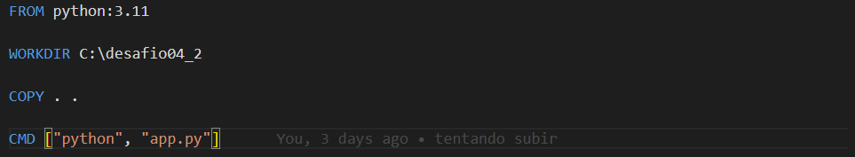

####
**Localização**: C:\Users\beatr\OneDrive\Área de Trabalho\ProgramaBolsas\Sprint4\README.md

## Informações
* Na parte **exercícios** encontrará minhas resoluções dos exercícios.
* Indo em evidências você consegue entender como desenvolvi o desafio do sprint.
* Em **certificados** irá encontrar quais cursos participei e conclui.

## Anotações

Nessa sprint pude aprender sobre programação funcional com Python e a ferramenta Docker. 

## Exercícios

Tivemos alguns exercícios de Python para colocar em prática a programação funcional. Nesses exercícios trabalhamos com funções como *map*, *sorted*, *filter* e muito mais. Aprendemos sobre funções lambdas e high order functions e a utilizar eles em alguns desses exercícios. Mostrarei um deles como exemplo. 

O exercício nº 1 pedia que, a partir de um arquivo com 10.000 números, apresentasse os 5 maiores valores pares e a soma deles. Além disso, eu precisava usar lambdas, o conceito high order function e funções como map, filter, sorted e sum. 

Comecei abrindo o arquivo e lendo com o *with open*, após isso criei uma função onde ele mudava os números de string para float, utilizando o map onde ele pegava os números do arquivo e devolvia como valor int dentro de uma lista com o list. 

Após isso, eu precisava filtrar somente valores pares, com isso eu usei o filter e o lambda. O lambda tem uma vantagem de não precisar criar uma função por fora e depois chamar, por isso vamos utilizá-la. Com o lambda dentro de filter, criei a expressão *num%2 == 0* para devolver apenas números pares da lista numeros. Para finalizar, utilizei o sorted para ordenar os números pares em ordem decrescente.

Para somar apenas os 5 primeiros valores, criei a função *soma_5*. Nela eu preciso chamar uma funçao (conceito de high order function) e pegar apenas os primeiros 5 valores com *lista[:5]*, a soma só foi preciso utilizar a função *sum* e depois retornar o valor.

Após estruturar tudo isso, era só utilizá-los com *soma = soma_5(conteudo,filtro)* e printar o resultado. 

## Evidências

#### Criação do Dockerfile para poder criar a imagem do carguru.

#### Criação da imagem do carguru com o build.

#### Mostrando as imagens criadas no meu Docker, principalmente imagem carguru.

#### Rodando a imagem carguru no container com run.

#### Demonstrando que é possível reiniciar containers com o start.

#### Criação do Dockerfile para o script hash.

#### Criação do script hash com a biblioteca hashlib para encriptar strings com sha-1.

#### Criação da imagem mascarar-dados com o build.

#### Rodando imagem mascarar-dados no container com o run.

#### Exercício nº 1 proposto nessa sprint para praticar programação funcional, utilizando lambdas, high order function e funções como map, sorted, sum e muito mais. 

## Certificados

Pude participar do curso da AWS  e aprender mais sobre seus príncipios,como trabalham e suas ideias de negócios. Uma base para poder um dia trabalhar com eles.

