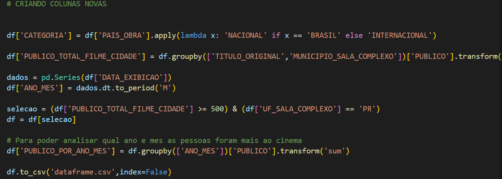

####
**Localização**: C:\Users\beatr\OneDrive\Área de Trabalho\ProgramaBolsas\Sprint4\README.md

## Informações
* Na parte **exercícios** encontrará minhas resoluções dos exercícios.
* Indo em evidências você consegue entender como desenvolvi o desafio do sprint.
* Em **certificados** irá encontrar quais cursos participei e conclui.

## Anotações

Nessa sprint pude aprender sobre os serviços da aws.Coloquei-os em prática por meio de jogo e de atividades. 

## Exercícios

O exercício dessa sprint tinha como objetivo fazer com que explorássemos nossas capacidades no serviço AWS S3. Foi pedido que criássemos um bucket, configurássemos ele e hospedássemos um site estático. 

Comecei criando meu bucket, clicando no botão *criar bucket*.

Após isso, comecei com as configurações. Primeiro precisei habilitar a hospedagem do site estático. Entrei em propriedades, cliquei em editar a seção hospedagem estática de sites e ativei essa opção. Além disso, foi preciso inserir alguns documentos, como *index.html* e *404.html* para o site.
O arquivo *index.html* foi criado localmente e o *404.html* também.

Depois de habilitar a hospedagem, era preciso dar acesso ao público. Em Permissões, cliquei em editar Bloqueio de acesso público e desmarquei a opção bloquear todo o acesso público. 

Além de permitir que o público tenha acesso a nosso conteúdo, precisamos criar uma política de bucket para conceder acesso público somente de leitura ao bucket, deixando o mais protegido. Assim, em Permissões, novamente, vamos em política de bucket e vamos colocar um script json que faça isso para nós. 

Para finalizar, é preciso fazer os uploads dos arquivos no bucket. 

O arquivo *nomes.csv* encontra-se dentro da pasta dados.

Agora é só testar o endpoint e verificar se ele faz o download quando clicamos no link. 

## Evidências

Evidência do script python utilizando biblioteca os e pandas com o objetivo de juntar vários arquivos csv em um único arquivo, para finalmente poder subir para o bucket. 

Evidência do script de python, utilizando a biblioteca boto3 para enviar o primeiro arquivo csv para o bucket.

Evidência da primeira parte do script python cumprindo os critérios de utilizar função condicional, função de conversão e função de string.

Evidência da segunda parte do script python contendo novas colunas a partir de análises feitas em cima do arquivo csv. Critérios cumpridos: utilização de dois operadores lógicos em um cláusula, utilização de duas funções de agregação, utilização de função de data.

Evidência do código feito para enviar o segundo csv, dataframe novo gerado a partir do script com os critérios estabelecidos, para o bucket. 

## Certificados

Certificado do curso preparatório para a prova AWS que em breve irei fazer.

Badge do jogo da AWS, onde pude aprender sobre os serviços AWS e praticar.
