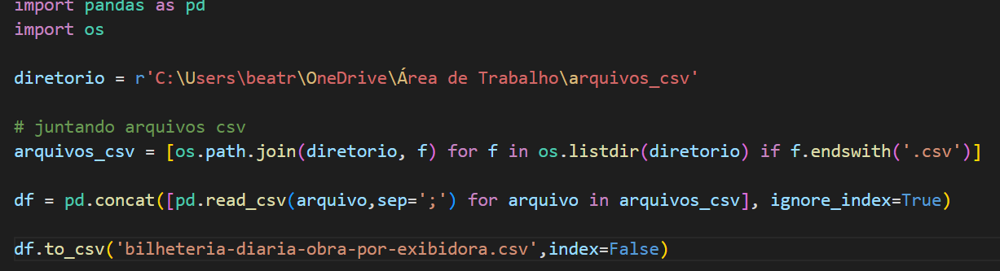
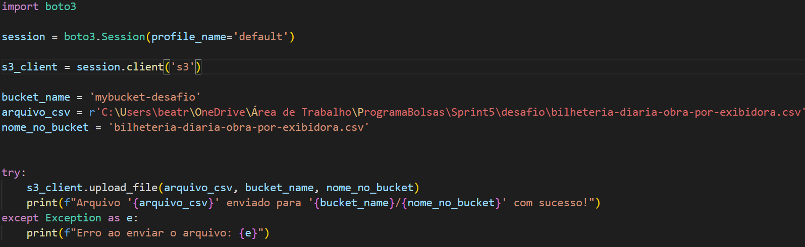
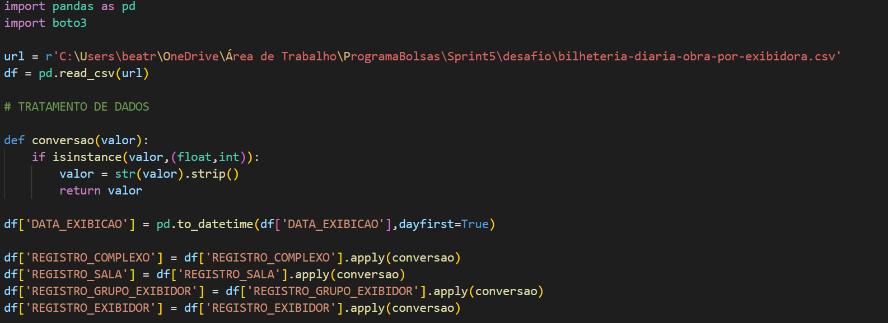
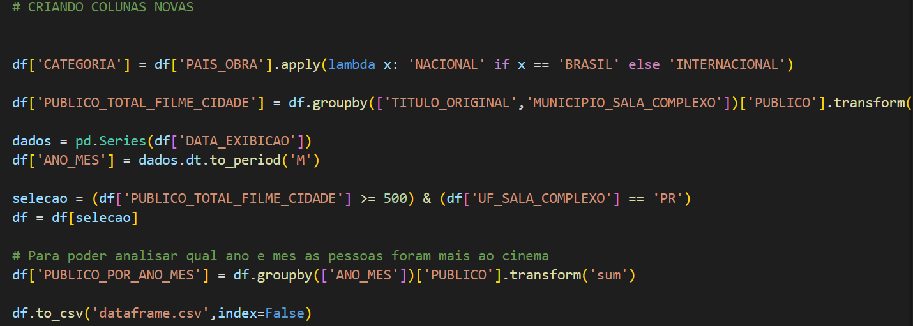
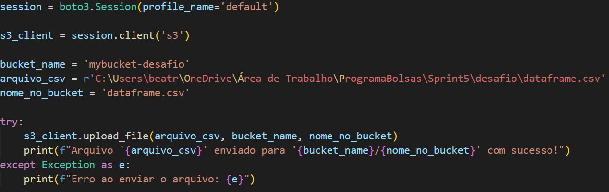

## Desafio

Aqui você encontrará o passo a passo de como solucionei o desafio da Sprint 5.

**Localização**: C:\Users\beatr\OneDrive\Área de Trabalho\ProgramaBolsas\Sprint5\desafio\README.md

O desafio da Sprint 5 tem como objetivo a prática dos conhecimentos apreendidos da nuvem AWS.

### 1 ETAPA

Antes de começar o desafio, foi preciso escolher os dados que iríamos trabalhar no desafio. O meu conjunto de dados foi um relatório de bilheteria diária de obras informadas pelas exibidoras. Nesse relatório havia muitos arquivos csv's, então eu decidi juntar apenas dos anos de 2023 a 2024. Para isso eu precisei criar um script que juntasse todos esses arquivos.

Eu utilizei a biblioteca *pandas* e *os*. O *os.listdir* lista todos os arquivos que contém no diretório que especifiquei na variável *diretorio*. O *f.endswith('.csv')* verifica se todos os arquivos dentro do diretório são csv. O *os.path.join* gera um caminho completo para cada arquivo desse diretorio. Por fim, a variável *arquivos_csv* irá conter uma lista de caminhos.

Agora chegou a hora de concatenar esses arquivos. Primeiro eu fiz a leitura de todos os arquivos com o *pd.read_csv()* e utilizei o for para fazer a leitura em todos os arquivos dessa lista. Então, eu pude concatenar com *pd.concat()* e usei o *ignore_index=True* para que os índices sejam consecutivos. 

Para a próxima etapa, eu salvei o arquivo final com *df.to_csv()*.

### ETAPA 2

Agora aqui eu tenho os dados em um único arquivo e posso subir para o meu bucket. 

Esse script em python é para subir meu arquivo csv para o meu bucket no S3. Antes de rodar esse código foi preciso baixar o AWS CLI na minha máquina, para que no prompt de comando eu pudesse passar minhas credenciais com o *aws configure*. Após isso, ele cria localmente uma pasta *.aws* e um arquivo *credentials* onde a biblioteca boto3 irá localizar minhas credenciais. 

Comecei criando uma sessão com o *boto3.Session* com o perfil default. Já no *session.client('s3')* estou criando um cliente que irá utilizar as credenciais definidas no meu arquivo credentials.

Em *bucket_name* passo o nome do meu bucket no S3, em *arquivo_csv* o arquivo que irei enviar para o bucket, em *nome_no_bucket* o nome que terá o arquivo enviado lá no bucket.

Para enviar utilizo o *s3_client.upload_file()* e faço dentro do try e except para caso dê erro eu consiga verificar e arrumar mais rápido. 

### ETAPA 3

Na etapa 3, preciso criar um script python que irá manusear esse arquivo csv que gerei. Gerando um novo dataframe que também precisarei enviar para meu bucket. 

Nesse script há algumas exigências do que deve conter, irei mostrando conforme irão aparecendo.

Comecei fazendo a leitura do arquivo com *pd.read_csv()* e criando uma função de conversão para algumas tabelas que estavam no tipo float e int e precisavam estar no tipo str. Nessa função, primeiro eu verifico se é uma instância do tipo float ou int, caso seja, faço a conversão e, além disso, elimino espaços nas extremidades das colunas. Nessa parte cumpri os critério de função de conversão, função condicional e utilização de uma função string.

Criei algumas novas colunas, como *CATEGORIA* separando filmes por nacionais e internacionais, utilizando a função lambda, para uma possível análise futura. 
Outro critério era a utilização de duas funções agregadas, utilizei o *groupby* e o *sum* criando uma nova coluna *PUBLICO_TOTAL_FILME_CIDADE* onde eu agrupei pelas colunas *TITULO_ORIGINAL* e *MUNICIPIO_SALA_COMPLEXO* somando os valores da coluna *PUBLICO* para poder analisar qual o filme mais assistido de determinada cidade por exemplo. 
Quis criar uma coluna *ANO_MES*, onde utilizei o critério de função de data, onde pego apenas o mês e o ano com a função *dt.to_period*. 
Outro critério é o uso de dois operadores lógicos em uma cláusula. Assim, eu fiz um seleção onde pego *'PUBLICO_TOTAL_FILME_CIDADE' >= 500* e *'UF_SALA_COMPLEXO' == 'PR'* juntando com o & (and de bit em bit). Para finalizar, quis fazer mais um análise, que era agrupar a coluna *ANO_MES* e somar por *PUBLICO* obtendo qual ano e mês as pessoas foram mais ao cinema. Por fim, salvei o novo dataframe com *df.to_csv()*.

Após fazer todo o trabalho em cima do arquivo, precisamos enviá-lo também para o bucket. Assim, fiz a mesma coisa na etapa 2, mudando apenas o arquivo que seria enviado e o nome dele no bucket.

