####
**Localização**: C:\Users\beatr\OneDrive\Área de Trabalho\ProgramaBolsas\Sprint6\README.md

## Informações
* Na parte **exercícios** encontrará minhas resoluções dos exercícios.
* Indo em **evidências** você consegue entender como desenvolvi o desafio do sprint.
* Em **certificados** irá encontrar quais cursos participei e conclui.

## Anotações

Nessa sprint pude aprender, através de vários cursos, sobre os fundamentos de analytics e muitos outros serviços da AWS. Fiz atividades utilizando serviços da Amazon, como Athena e Lambda, colocando os meus conhecimentos em prática. Além do mais, com o desafio, pude revisitar vários assuntos que aprendi durante minha jornada aqui no Programa de Bolsas.

## Exercícios

Para executar esses exercícios, reutilizei o bucket da atividade passada da sprint 5.

### Exercício Athena

O serviço Athena da AWS é um serviço de análises. Aqui vamos iniciar criando uma pasta no bucket chamado queries, onde ficará armazenada todas as consultas executadas.

Após criar a pasta, vamos começar a mexer no serviço Athena. Agora é preciso passar o caminho do bucket e a pasta que armazenará as consultas. Acessando configurações, vamos em gerenciar, na caixa localização dos resultados da consulta basta inserir o caminho e salvar.

No serviço Athena tem um espaço onde podemos executar consultas e instruções. Precisamos agora criar um banco de dados, sendo assim utilizaremos o comando *create database meubanco*.

Após criar o banco, na lista Database à esquerda, vamos colocar o *meubanco* como banco de dados atual.

Após criar o banco de dados, vamos criar uma tabela.

 

Aqui vamos passar as colunas e os tipos de dados que irão receber. Além do mais estamos passando a localização da pasta dados que contém o arquivo *nomes.csv* do mesmo bucket que a pasta queries. 

Com a tabela criada e com os dados armazenados, podemos começar a fazer algumas consultas.

Resultado da consulta:

Para finalizar a atividade, foi pedido que criássemos uma consulta que listasse os 3 nomes mais usados em cada década desde os anos 1950 até hoje.

Para isso, criei um *WITH* chamado decada, com colunas nome,sexo, total, ano e decada que recebe a função *floor* que divide o ano por 10 e arredonda esse valor, deixando a fração de lado. Depois multiplicamos por 10 para compor o ano novamente. Essa estratégia foi usada para que de determinado ano, exemplo 1957, pegamos somente a década, no caso de 1957 é pego 1950. Como foi pedido que pegasse de 1950 até hoje em dia, usamos o *WHERE* e *>=1950*.

Em decadas_rank é onde vamos determinar o ranking dos nomes mais populares. Peguei as colunas decada, nome, fiz uma soma na coluna total. Em *row_number* estou criando uma numeração para cada nome dentro de sua respectiva década com *partition by decada*. Além disso, com *order by* em sum(total) ordeno em ordem decrescente os nomes pela soma total.

Após todas essas subqueries, faremos a consulta final. Seleciono apenas as colunas que quero com *Select*, da subquerie decadas_rank, com *where* filtro apenas os 3 primeiros nomes e ordeno por decada e rank.

Resultado: 

### Atividade Lambda

Irei reutilizar o bucket das atividades de Athena e da sprint passada. 

O serviço lambda da AWS é um serviço que executa um código em resposta a eventos. Para iniciar a atividade, vamos começar criando uma função lambda. Basta acessar o serviço AWS e selecionar criar uma função. Após isso, você precisa nomear ela e em *Runtime* escolher Python 3.9. Por fim, é só clicar em criar a função. 

Com a função criada, é preciso construir um código. Com o código pronto, basta clicar em *Deploy* para atualizar as alterações feitas.

Com a função atualizada, precisamos testá-la. Clicando em *Test* e escolhendo o nome para o teste.

Após rodar verificamos um erro, o qual ocorreu por falta da biblioteca pandas. Com os layers(camadas) conseguimos importar bibliotecas que são necessárias para rodar as funções lambdas.

Para criar essa camada, vamos usar o método do console da Lambda com comandos do prompt e arquivos no formato zip. Com esse método, vamos instalar as bibiotecas python e outras dependências necessárias utilizando o Docker e, em seguida, compactando-os para serem carregados na camada.

Primeiro é preciso criar um arquivo Dockerfile.

Depois do arquivo criado, precisamos construir uma imagem.

Agora que temos a imagem, precisamos rodá-la dentro de um container e acessar o shell do container.

No shell vamos criar a pasta que receberá as bibliotecas para as camadas que ainda vamos criar. Dentro do diretório Python vamos começar as instalações das bibliotecas. 

Após as instalações serem concluídas com sucesso, vamos ir para o diretório layer_dir e vamos compactar a pasta python.

Após a compactação feita, precisamos copiar o arquivo zip para a máquina local. Para isso precisamos descobrir o id do nosso container. Com o id do container podemos copiar o arquivo para a máquina local.

Após isso, vamos fazer o upload desse arquivo zip para um bucket. Esse bucket será o mesmo que já utilizei para as atividades passadas. 

Agora, para finalizar, precisamos carregar o arquivo zip na Lambda para criar a camada. Acessando Camadas, iremos criar uma camada.

Para criar essa camada foi preciso escolher o nome e fazer o upload do arquivo zip lá do S3, copiando a URL do objeto e colando o link.

Depois de criada, vamos utilizar ela. Para isso, basta clicar na função que criamos, ir em camadas e escolher a camada que criamos. 

Por final, vamos testar para ver se agora dá certo.

## Evidências

Evidência sobre a primeira parte da criação do script, contendo a importação das bibliotecas, a concatenação do caminho dos arquivos movies e series, a criação da variável data utilizando funções para pegar a data atual de quando rodar o código e, por fim, para acessar a conta AWS a criação de uma sessão e de um usuário para interagir com os serviços AWS para a realização do desafio.

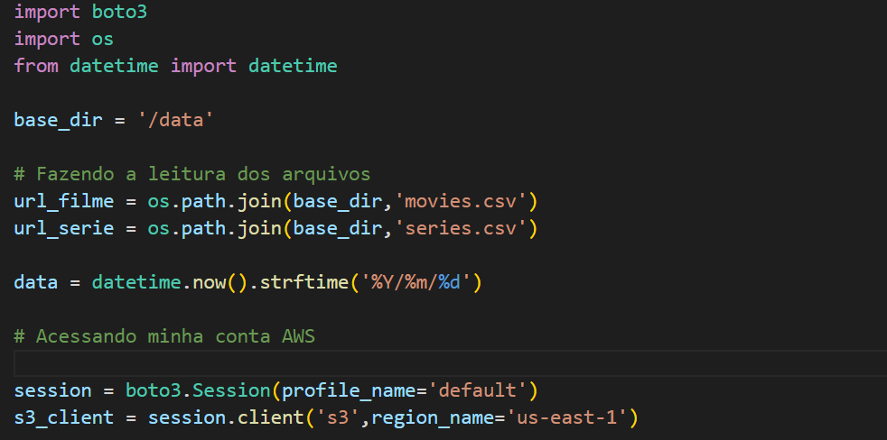

No desafio é pedido que um caminho seja gravado quando subirmos os arquivos no bucket, para isso criei as variáveis path tanto para filme e serie. Além disso, foi criado uma variável para o nome que quero para o bucket.

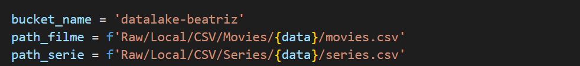

Criei uma função para criar buckets utilizando funções como *create_bucket()*.
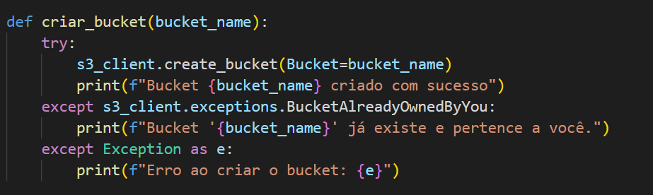

Criei uma função para fazer o carregamento dos arquivos com a função *upload_file()* e no final fiz a chamada das funções.

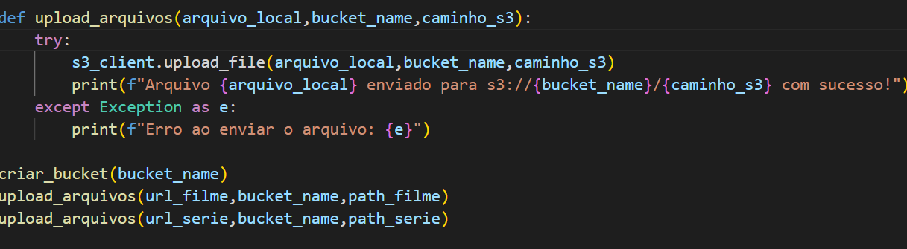

O script criado acima será rodado dentro de um container, por isso é preciso criar um arquivo Dockerfile. Neste arquivo temos a imagem python que será utilizada, criação de diretório e cópia de arquivos de um diretório para outro. Além disso, foi preciso instalar a biblioteca boto3 para conseguir rodar os comandos *python* e *desafio.py* dentro de CMD.

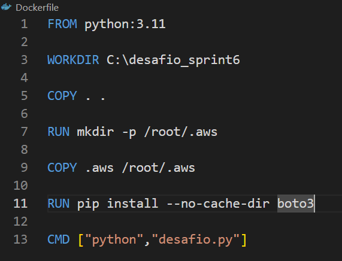

Com o arquivo Dockerfile pronto, precisamos criar a imagem com o docker build.

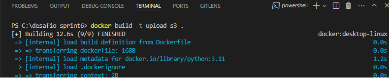

Depois de criar a imagem, é preciso rodá-la dentro de um container. Como no desafio foi pedido um volume para armazenar os arquivos, escolhi o Bind Mount. Assim posso rodar o arquivo e já utilizar de um volume.

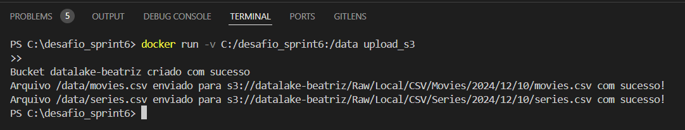

## Certificados

Neste curso pude aprender sobre conceitos básicos, como tipos de analytics, os 5 Vs do big data e os desafios associados ao processamento de grandes volumes de dados.

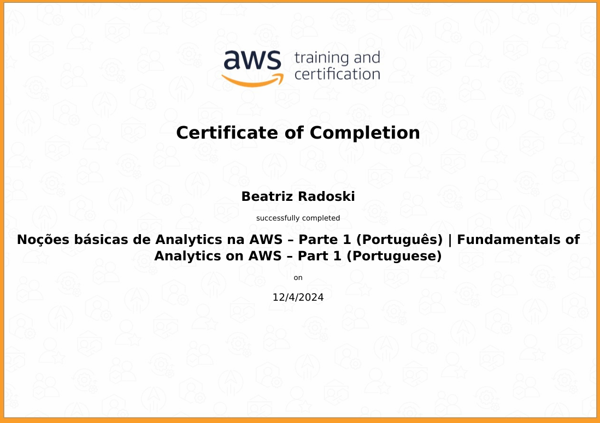

Neste curso pude continuar a aprender sobre os fundamentos de Analytics tendo uma visão geral sobre conceitos básicos, como tipos de analytics, os 5 Vs do big data e os desafios associados ao processamento de grandes volumes de dados.

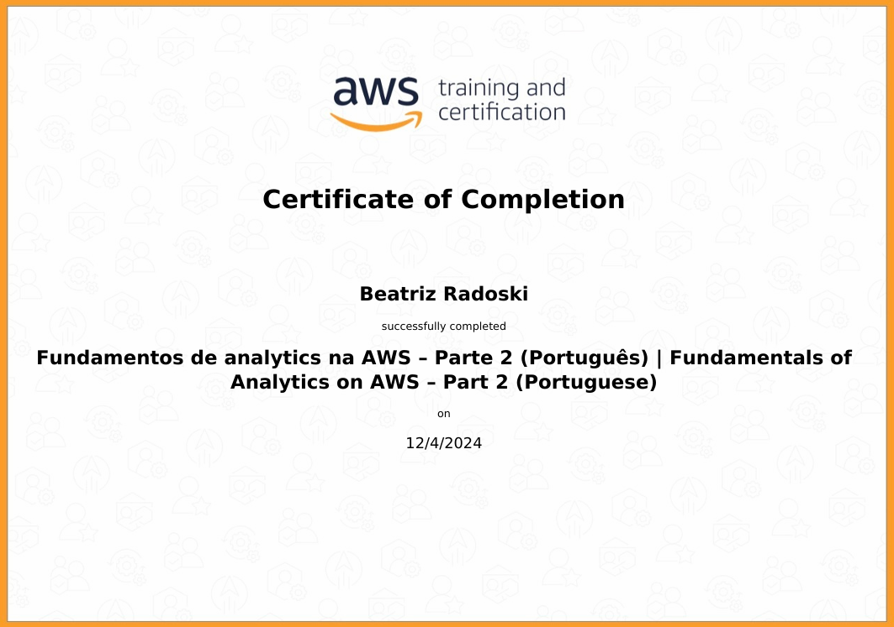

Neste curso pude aprender sobre o serviços da AWS sem servidor.
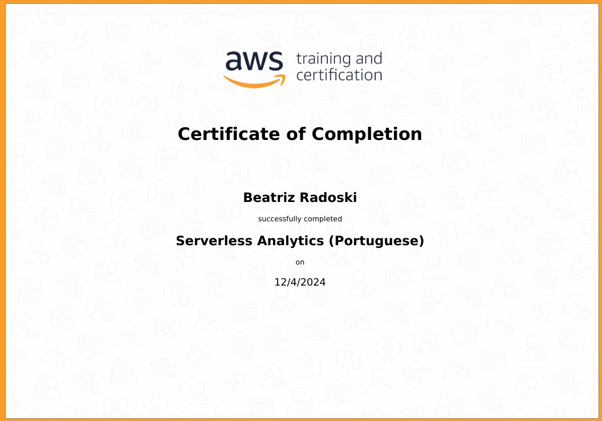

Este curso apresenta o serviço Amazon Athena junto com uma visão geral do ambiente operacional.
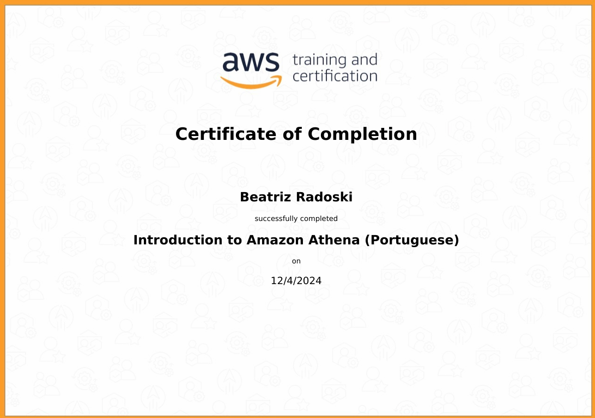

Neste curso pude aprender sobre o Serviço Glue da Amazon. É um serviço de integração de dados sem servidor que você pode usar para descobrir, preparar e combinar dados para análise, aprendizado de máquina e desenvolvimento de aplicativos.

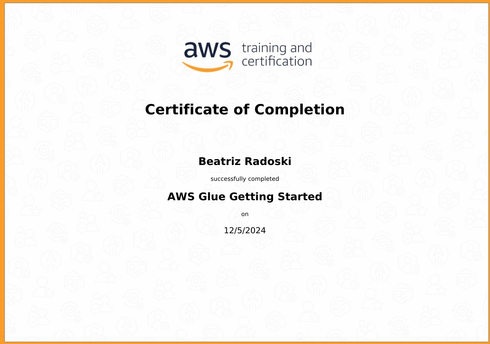

O Amazon EMR é a solução de big data em nuvem líder do setor para processamento de dados em escala de petabytes, análises interativas e aprendizado de máquina usando estruturas de código aberto, como Apache Spark, Apache Hive e Presto.

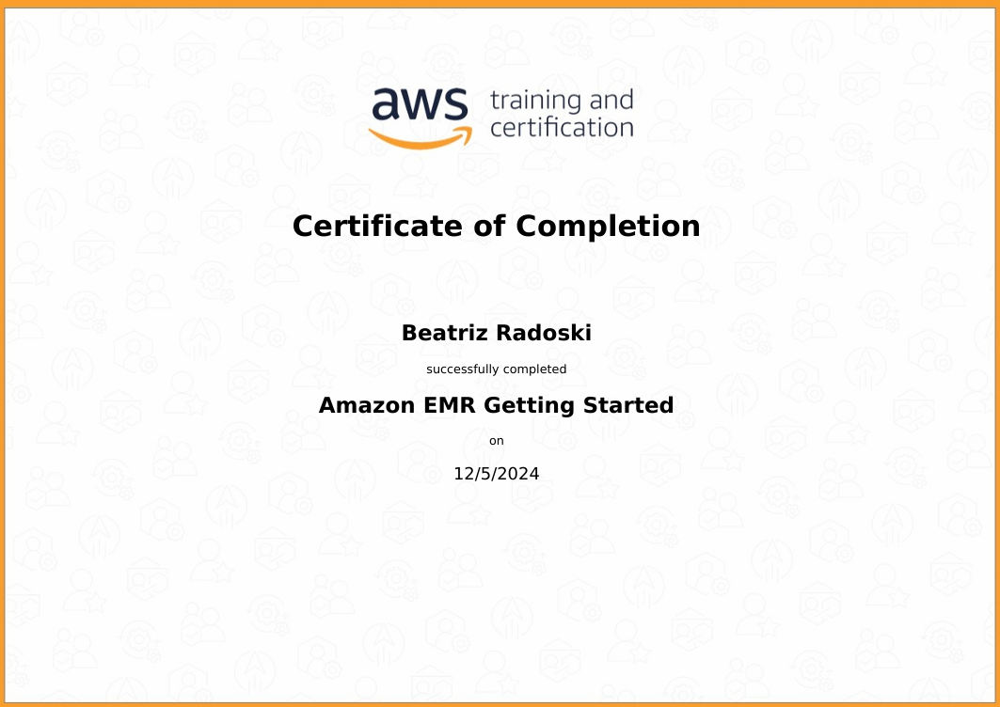

Neste curso, pude aprender os benefícios, os casos de usos mais comuns e os conceitos técnicos do Redshift.

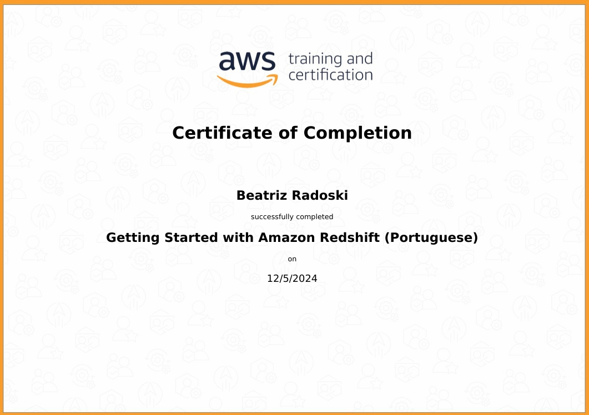

Neste curso pude aprender sobre os conceitos de implementação de uma data warehouse usando o Amazon Redshift.

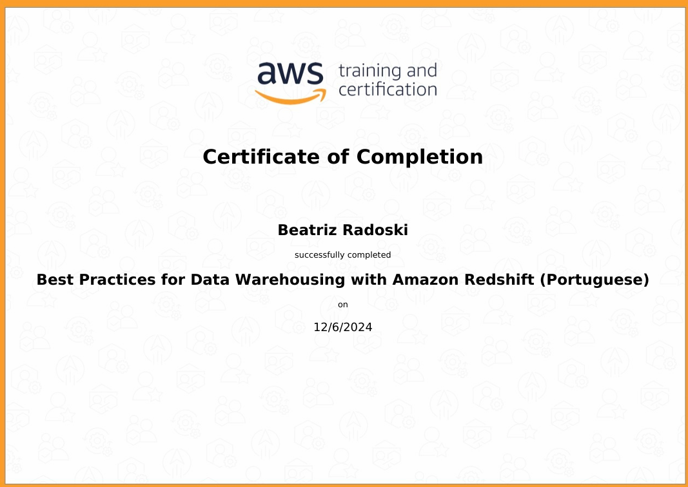

O Amazon QuickSight é um serviço de business intelligence (BI) em escala de nuvem que você pode usar para criar e publicar painéis interativos.
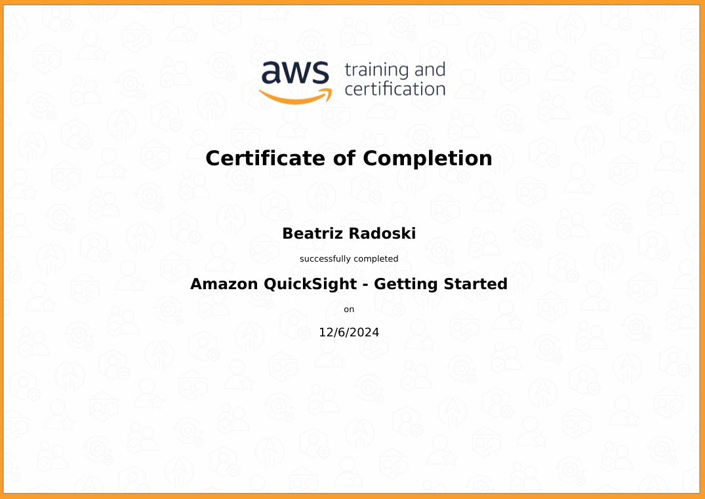