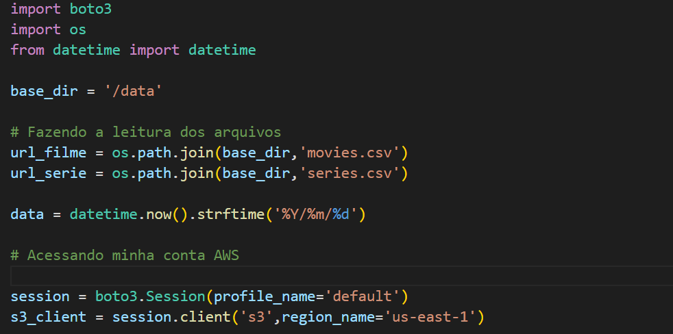
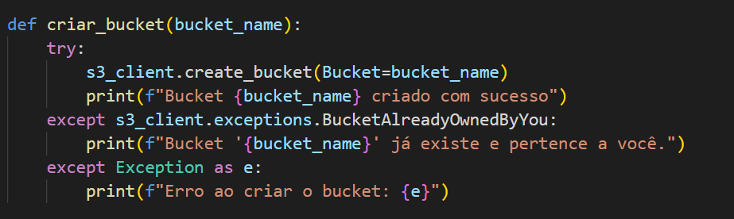
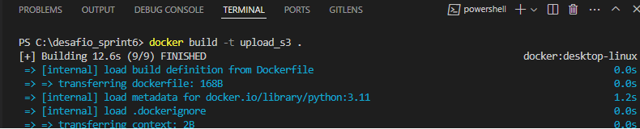
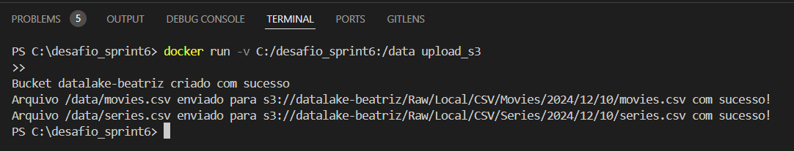

## Desafio
Aqui você encontrará o passo a passo de como solucionei o desafio da Sprint 6.

A partir da sprint 6 começarei a entrega, por partes, do desafio final. Ou seja, o desafio final é constituído de 5 entregas. 

**Localização**: C:\Users\beatr\OneDrive\Área de Trabalho\ProgramaBolsas\Sprint6\desafio

## Detalhamento do desafio

Nessa primeira entrega focaremos na ingestão dos arquivos csv em Bucket Amazon S3 RAW Zone. Construirei um script python que rodará dentro de um container. Esse script deve carregar os arquivos CSV, criar um bucket no serviço S3 e carregar para lá esses arquivos. 

Além disso, nessa primeira parte, preciso decidir as análises que irei fazer em cima desses dados no decorrer dessas entregas. Lembrando que o tema dos filmes que estou trabalhando é Ação e Aventura.

#### Análises 

1 - Comparar o orçamento total e a receita total dos filmes escolhidos observando se o filme foi rentável. Além disso, fazer uma comparação entre as produtoras de quem tem maior orçamento para os filmes. Outro ponto é sobre analisar em cima da comparação entre orçamento e quantidade de filmes. Será que as produtoras preferem liberar pouco orçamento e produzir mais filmes, ou liberar bastante orçamento e produzir poucos filmes?

2 - Comparação de orçamento em filmes produzidos agora e de anos atrás. 

3 - Avaliar, através de identificadores externos da API, como o filme é compartilhado por lá. Exemplo: Quais são as publicações do Facebook assimilado a esse filme e como ele ajudou na propaganda, ou se não. Como ele é avaliado lá, etc. Se essas redes sociais foram fundamentais para maior popularidade ou não, para divulgação. Comparar também por décadas ou anos, em que anos foram mais utilizadas essas plataformas para divulgação, compartilhamento de opnião.

4 - Em cima da análise 4 comparar o indíce númerico de popularidade, média das avaliações dos usuários com os dados de opniões nas redes sociais. Serão as mesmas? 

## Solução do desafio por etapas

### Script Python

Nesse script utilizei as bibliotecas boto3, os e datetime. Pode-se observar as importações no início.

Comecei definindo a variável *base_dir = '/data'* pois irei utilizá-la quando for criar meu volume do tipo bind mount, será o local onde os arquivos ficarão armazenados dentro do container.

Após isso, trabalhei nos caminhos dos arquivos CSV, concatenando a variável *base_dir* com os nomes dos arquivos. Ficando:
        */data/movies.csv*
        */data/series.csv*

Como precisarei trabalhar no caminho da gravação desses arquivos lá no bucket S3 da AWS, criei uma variável data que fará parte desse caminho. Para ficar mais automatizado, utilizei a função *now()* para pegar a data atual e o *strftime()* para poder formatar a data no formato *AAAA/MM/DD*.

Como preciso acessar minha conta na AWS para poder criar o bucket e carregar os arquivos para lá através do boto3, preciso que ele consiga acessar minhas credenciais e fazer o acesso. Desse modo, com a função *Session* eu crio uma sessão passando o perfil que ele irá utilizar, sendo o padrão. Crio com *client* um cliente que utilizará dessa sessão para interagir com os serviços AWS.

Para continuar, criei outras variáveis. Como o *bucket_name* que irei utilizar posteriormente. As variáveis *path_filme* e *path_serie* onde faço a gravação dos caminhos dentro do bucket, como pedido no desafio.

Como forma de deixar mais modularizado, criei a função *criar_bucket*, onde utilizo o *try* e *except* como tratamento caso dê erros. Dentro da função temos *create_bucket* que recebe a variável *bucket_name* passando o nome que quero para o bucket. Tenho o except tanto para caso já haja um bucket criado como também caso dê erro ao criar o bucket.

Além de uma função para criar um bucket, fiz também para fazer o carregamento dos arquivos CSV no serviço S3. Nessa função passo como parâmetro o caminho do arquivo localizado na meu container,o nome do bucket que será carregado os arquivos e o caminho do arquivo no bucket, o qual eu fiz a gravação anteriormente. A partir desses parâmetros, utilizo a função *upload_file()* dentro de um *try*, caso dê erro, o *except* me passa qual o erro ocorrido.

No final, preciso fazer a chamada dessas funções passando os parâmetros. 

### Docker

Após criar o script, precisamos fazê-lo rodar dentro de um container.

Começamos criando o arquivo Dockerfile.

No *FROM* eu passo a imagem python e sua respectiva versão que auxiliará na rodagem do script. O *WORKDIR* é área de trabalho que se encontra meus arquivos. *COPY . .* este comando é para copiar tudo que se encontra na área de trabalho para o container. *RUN mkdir -p /root/.aws* é para criar o diretório especificado. *COPY .aws /root/.aws* é para copiar os arquivos que tem na pasta *.aws* para o diretório criado anteriormente. *RUN pip install --no-cache-dir boto3* é para fazer a instalação da biblioteca boto3, para rodar nosso script. *CMD["python","desafio.py"]* é o que será rodado no prompt de comando para executar o python e o script desafio.py.

Após criar o arquivo Dockerfile, precisamos construir a imagem, utilizando o comando *docker build -t <nome da imagem> .*

Agora podemos rodar nossa imagem. No desafio pede que criemos um volume onde os arquivos ficarão. Desse modo, escolhi o volume do tipo bind mount. O bind mount é ideal para compartilhar diretórios específicos entre o host e o container. 

O comando utilizado para isso foi *docker run -v C:/desafio_sprint6:/data upload_s3*. Assim temos o caminho de C:/desafio_sprint6 mapeado para /data dentro do container. 

Rodando a imagem, temos os arquivos armazenados no volume, o bucket criado e os arquivos enviados com sucesso.

Observação: Como os arquivos são muito grandes, quando subir para o git, não farei o envio deles, isso foi uma dica da Scrum Master. Quando rodei o desafio, tinha copiado os arquivos para dentro do container. Tanto os arquivos series e movies, quanto minhas credenciais. Assim tive êxito no resultado final.