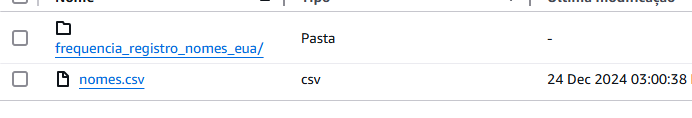
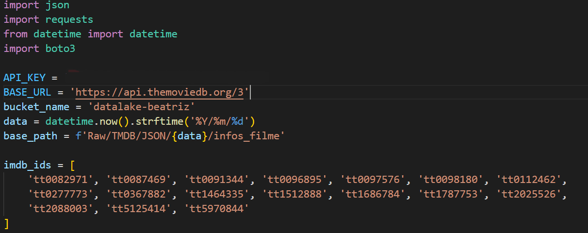
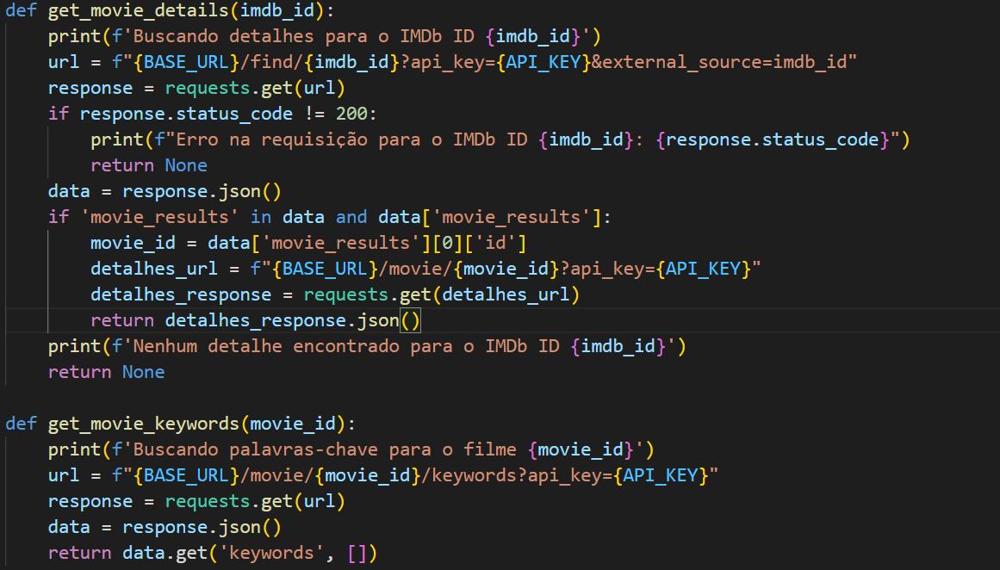
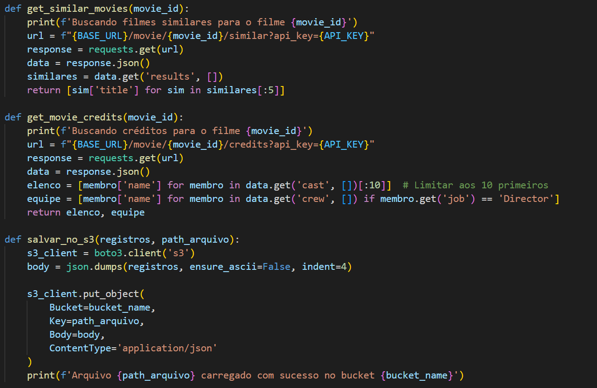
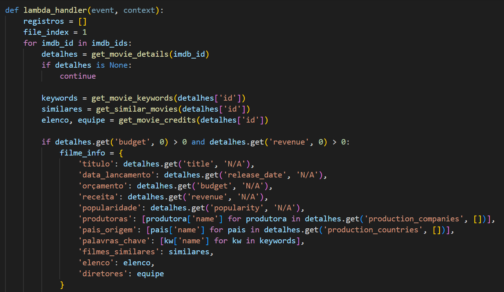
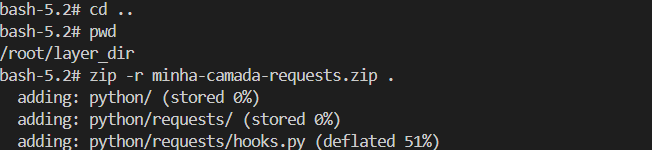
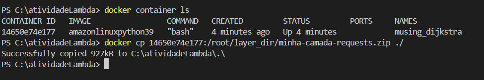

####
**Localização**: C:\Users\beatr\OneDrive\Área de Trabalho\ProgramaBolsas\Sprint7\README.md

## Informações
* Na parte **exercícios** encontrará minhas resoluções dos exercícios.
* Indo em **evidências** você consegue entender como desenvolvi o desafio do sprint.
* Em **certificados** irá encontrar quais cursos participei e conclui.

## Anotações

Nessa sprint, pude aprender sobre o framework de processamento de dados Apache Spark e a colocá-lo em prática. Além disso, aprendi a fazer requisições de API, essencial para essa etapa do desafio final. 

## Exercícios

### Contador de palavras

Nesta atividade, pude colocar em prática o Spark. Além do mais, utilizei conceitos das sprints anteriores, como o docker. 

Iniciei fazendo o pull da imagem *jupyter/all-spark-notebook*

Depois de fazer o download, pude rodar a imagem em um container com docker run. Como eu queria testar o meu código no Jupyter Lab, iniciei o container no modo interativo (-it) para poder pegar o link.

Código: 

Comecei importando da biblioteca do pyspark o SparkContext, pois precisarei dele para conseguir interagir com o Spark.

Como estava tendo problemas em rodar novamente o código na hora do teste, pois dizia que já existia uma instância do sc ativa, fiz um trecho onde verifica se há uma instância ativa e ele para. 

Acima comentei da importância do SparkContext, antes de iniciar o código, preciso criar uma instância que vai interagir com o Spark, por isso a criação da variável sc.

Após isso, passei o caminho do arquivo, o sc com o textFile() irá ler o arquivo e criar um RDD (várias partições dos dados).

Agora a parte mais importante, a aplicação. A parte do *flatMap* que quebra as linhas em palavras, usando o espaço como separador e retorna um RDD onde cada palavra é um elemento individual. No *map* em cada palavra como elemento, ele adicionará o número 1, criando agora (palavra,1). No *reduceByKey* ele combina as palavras que são iguais, fazendo a contagem. 

Para finalizar, um for para exibir a palavra e a contagem de determinada palavra.

Para conseguir rodar a aplicação com o arquivo do Readme, eu precisei baixar ele com o wget e passando o token, pois meu repositório é privado.

Com a aplicação, posso rodar o docker exec para abrir o terminal.

Após isso, precisei localizar ele, pois preciso passar o caminho do arquivo para a aplicação.

Com o arquivo localizado vamos para o pyspark.

Agora podemos executar linha por linha do código que irá rodar nossa aplicação.

### TMDB

Nessa atividade, criei um processo de extração de dados da api do TMDB, servindo como base para o desafio.

Comecei acessando o site da api e fazendo meu cadastro. Após isso, editei meu perfil para uso pessoal e que meu objetivo de uso é para estudos. Após isso, peguei o código python, inseri minha chave da api e fiz a requisição.

### Glue

Nesta atividade, pude constuir um processo de ETL utilizando o Glue.

Comecei criando um bucket para essa atividade e adicionando o arquivo lá.

Após isso criei uma role com determinadas políticas.

Depois de criar a role, temos que adicioná-la ao serviço Glue, dando acesso total ao S3 e permitindo leitura e escrita.

Indo para o aws Lake Formation, iremos 
utilizá-lo para criar o banco de dados no qual nosso crawler irá adicionar automaticamente uma tabela 
a partir dos dados armazenados no S3. Aqui eu criei um banco de dados.

Para conseguir fazer o processamento do arquivo que está armazenado no bucket, precisei criar um job no Glue e configurar algumas propriedades.

Para conseguir rodar o script teste, tive que adicionar alguns parâmetros em job details, informando o caminho do meu bucket e do arquivo dentro do bucket.

Código criado para o job:

Comecei importando todas as bibliotecas necessárias.

Depois defini os parâmetros necessários e fiz a inicialização do Spark e Glue Context.

A atividade pedia várias tarefas a serem feitas nesse código. Sendo:

Ler o arquivo nomes.csv no S3 e imprimir o schema do dataframe gerado no passo anterior. Escrever o código necessário para alterar a caixa dos valores da coluna nome para maiúsculo e imprimir a contagem de linhas do dataframe.

Na 4 tarefa era preciso imprimir a contagem de nomes, agrupando os dados do dataframe pelas colunas ano e sexo. Ordenar os dados de modo que o ano mais recente apareça como primeiro registro do datafram.

Na 5 e 6 etapa tive que apresentar qual foi o nome feminino e masculino com mais registros e em que ano ocorreu.

Na etapa 7 tive que apresentar o total de registros (masculinos e femininos) para cada ano presente no dataframe. *Considere apenas as primeiras 10 linhas, ordenadas pelo ano, de forma crescente*.

 
Além disso tive que salvar o conteúdo do dataframe com os valores de nome em maiúsculo no S3, realizando o particionamento por sexo e ano.

Para finalizar a atividade, tive que configurar um crawler com o nome *FrequenciaRegistroNomesCrawler*, com o caminho do s3 usado, com a role criada para o glue, com o banco de dados criado como destino.Depois foi só rodar e uma tabela foi criada no meu banco de dados.

## Evidências 

Evidência das importações das bibliotecas e definição das variáveis.

Evidência das funções get_movie_details e get_movie_keywords.

Evidência das funções get_similar_movies, get_movie_credits e salvar_no_s3.

Evidência da primeira parte da função principal.

Evidência da segunda parte da função principal.

Evidência da construção da imagem no docker.

Evidência rodando imagem no docker para obter o terminal, criação dos diretórios, instalação da bblioteca.

Evidência criando arquivo no formato zip do diretório python.

Evidência copiando o arquivo zip para a máquina local.

Evidência do caminho criado no bucket S3 da requisição dos dados da API do TMDB.

## Certificados

Nessa sprint não teve nenhum certificado AWS.
