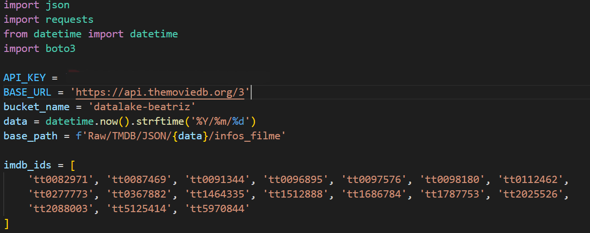
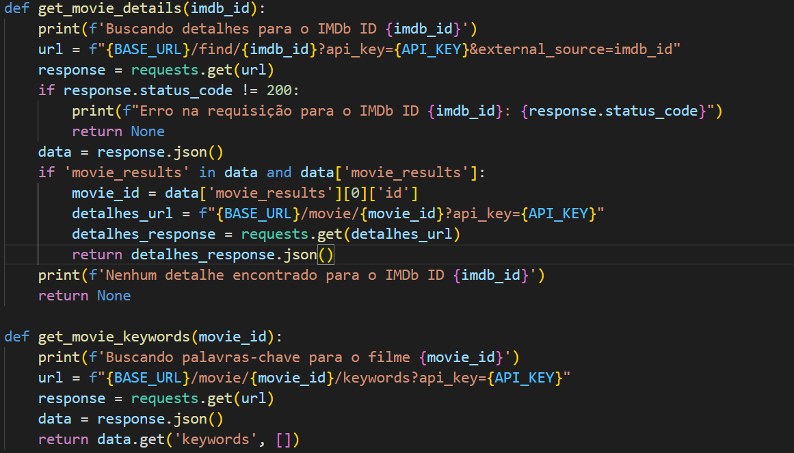
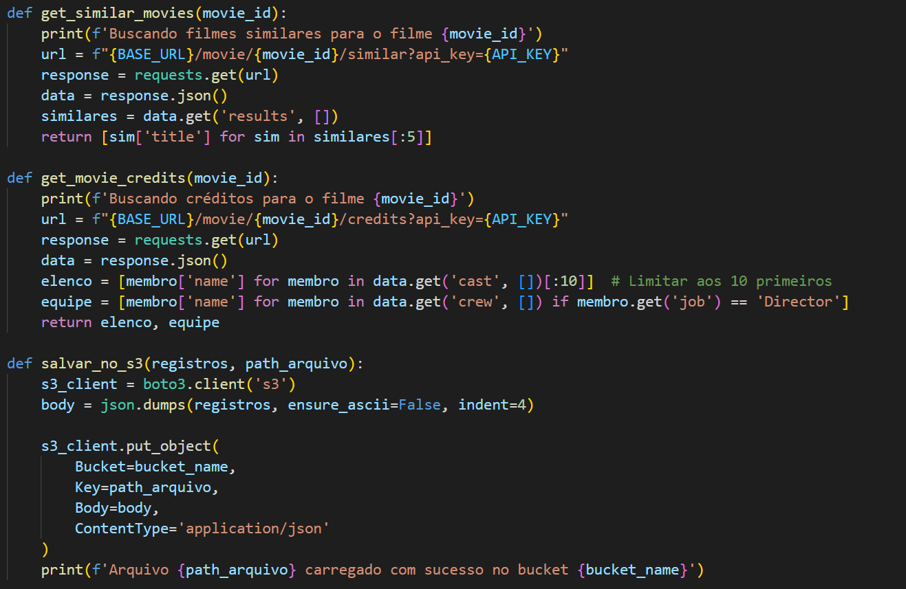
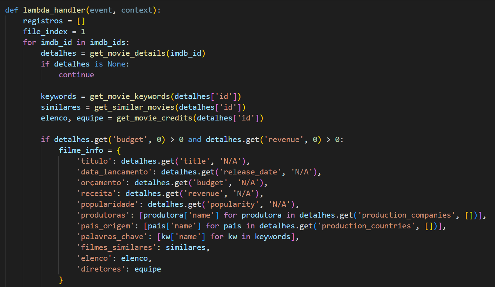
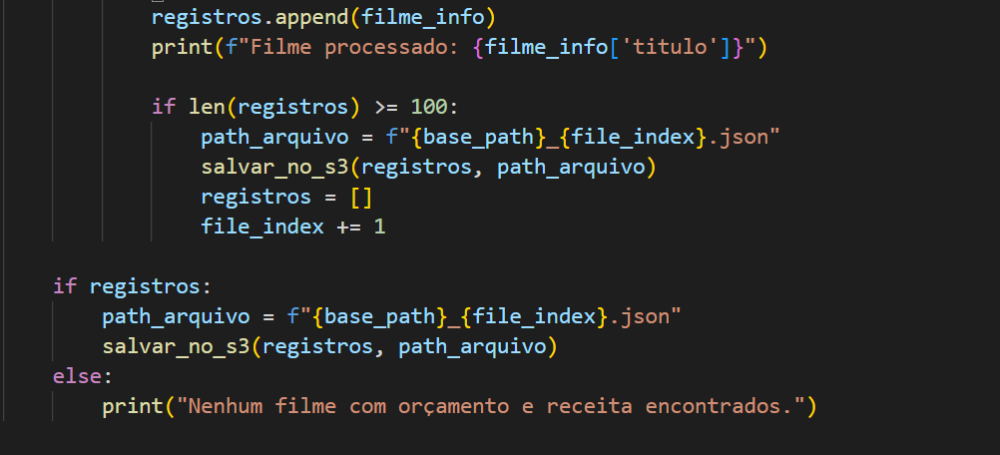
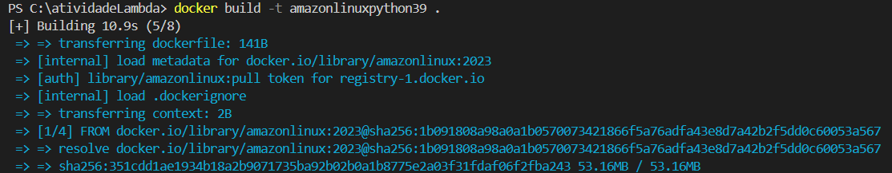
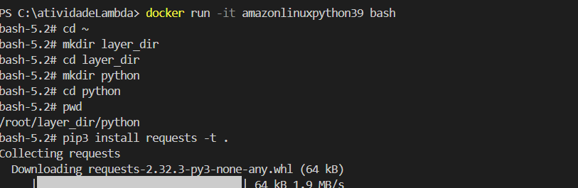
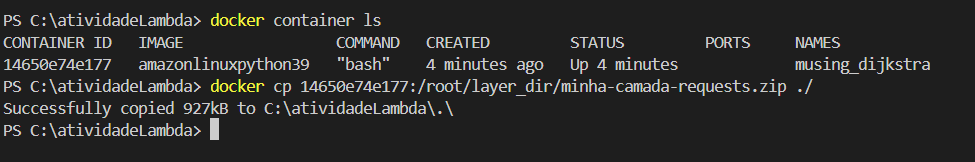
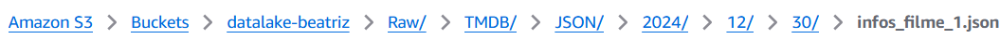

## Desafio
Aqui você encontrará o passo a passo de como solucionei o desafio da Sprint 7.

A partir da sprint 6 começarei a entrega, por partes, do desafio final. Ou seja, o desafio final é constituído de 5 entregas. 

**Localização**: C:\Users\beatr\OneDrive\Área de Trabalho\ProgramaBolsas\Sprint7\desafio

Nessa segunda entrega peguei dados da API do Tmdb via aws Lambda. Os dados, após serem puxados, foram salvos na Amazon S3.

### Código do lambda

Comecei fazendo as importações necessárias, como json, requests, datetime e boto3. Após isso, configurei algumas variáveis contendo minha chave da api, a url do site da TMDB, o nome do bucket que irei armazenar o arquivo com os dados do TMDB, a data atual que fará parte do caminho no s3, o caminho do arquivo que ficará salvo no s3 e, por fim, os id's dos filmes escolhidos para puxar os dados. 

Para fazer as requisições, criei algumas funções: 

A primeira é a get_movie_details que busca os detalhes de determinado filme/id. Primeiro com */find* ele busca o id no tmdb, caso seja encontrado, ele busca mais detalhes com */movie/{movie_id}* e depois retorna os dados no formato json.

Depois temos o get_movie_keywords para buscar as palavras chaves do filme usando o endpoint */movie/{movie_id}/keywords* e retorna com os dados no formato json.

O get_similar_movies é uma função para obter uma lista de filmes similares ao filme buscado, usando o endpoint */movie/{movie_id}/similar*, retornando apenas 5 filmes similares. Fiz até 5 para não retornar uma lista muito extensa. 

O get_movie_credits busca o elenco e a equipe técnica do filme, usando */movie/{movie_id}/credits*, retornando duas listas com os 10 primeiros nomes do elenco e os diretores do filme.

O salvar_no_s3 utiliza o cliente do boto3 para poder enviar os arquivos json para um bucket do s3. Além disso, converte os dados que não estão no formato json em formato json. No final, ainda exibe uma mensagem de sucesso ao enviar.

A função principal (lambda_hadler(event,context)) utiliza o for para iterar pela lista dos ids dos filmes, obtendo os detalhes dos filmes a partir das funções criadas acima. Além disso, como minha análise precisa essencialmente dos orçamentos e das receitas dos filmes, criei uma regra onde só pega os detalhes dos filmes que contém esses dois parâmetros. 

Além do mais, como pedido no desafio, o código após adicionar as informações na lista, ele verifica se o tamanho da lista passa de 100  registros, caso passe, ele manda o arquivo para o bucket especificado e esvazia a lista para começar novamente. Caso não de 100 registros até o final, ele salva depois tudo junto e não em lotes.

### Camada Requests

Como foi utilizado o serviço lambda da AWS, eu precisei criar uma camada para poder utilizar a biblioteca requests no código. 

Comecei construindo a imagem que já utilizei na atividade passada da sprint 6.

Após isso eu rodei a imagem para abrir o terminal shell.

Com o terminal aberto, pude criar os diretórios necessários, no caso, /root/layer_dir/python. Dentro desse caminho eu instalei a biblioteca requests. 

Após instalar a biblioteca, sai do diretório python, ficando apenas em root/layer_dir e comprimi o diretório python

Com o arquivo zip, agora basta copiar para a máquina local.

Com o arquivo zip, basta subir ele num bucket so S3, copiar a url desse bucket e ir criar uma camada passando essa url. Com a camada criada, você precisa ir em configurações e adicionar essa camada que acabamos de criar. E pronto, basta ir testar o código novamente e ele irá rodar com  sucesso.

