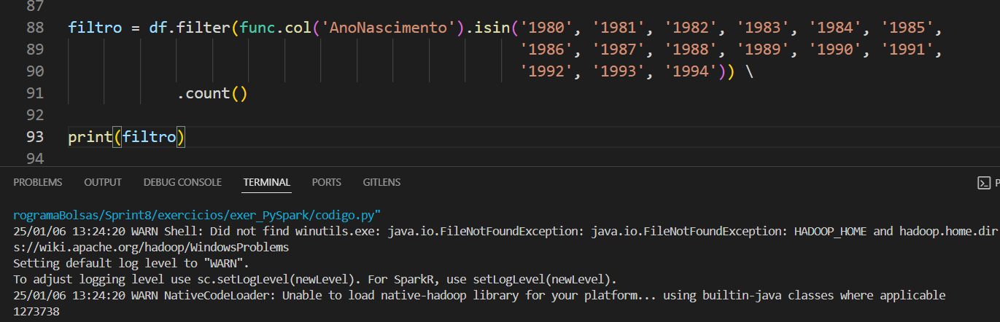
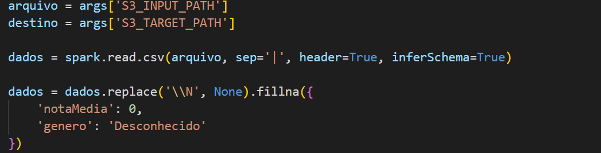
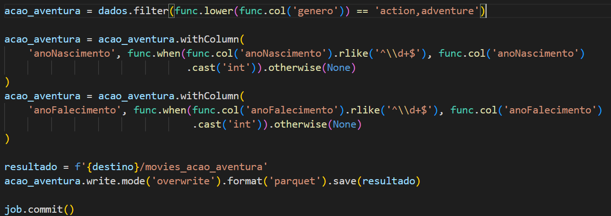
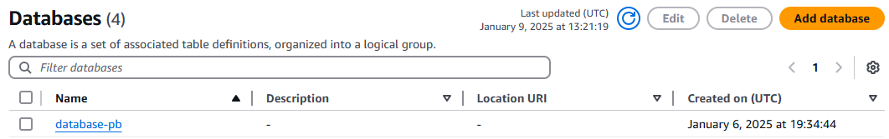
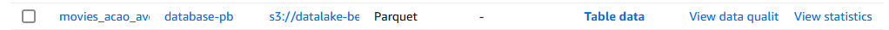
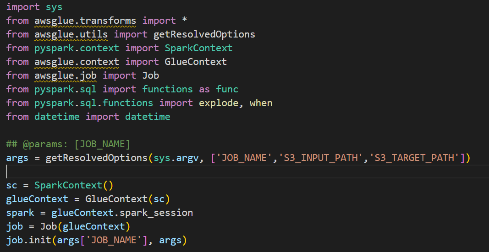
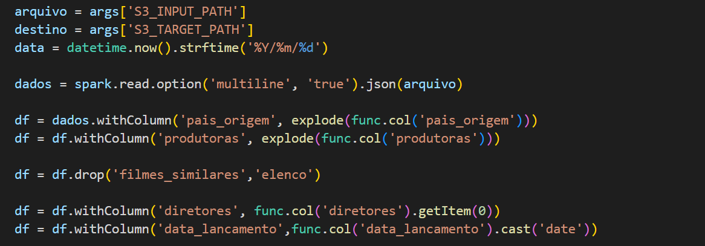

####
**Localização**: C:\Users\beatr\OneDrive\Área de Trabalho\ProgramaBolsas\Sprint7\README.md

## Informações
* Na parte **exercícios** encontrará minhas resoluções dos exercícios.
* Indo em **evidências** você consegue entender como desenvolvi o desafio do sprint.
* Em **certificados** irá encontrar quais cursos participei e conclui.

## Anotações

Nessa sprint, pude colocar mais em prática meus aprendizados sobre o Apache Spark e os serviços da AWS, focando no processamento de dados com o Glue.

## Exercícios

Nessa sprint tivemos alguns exercícios para colocar em prática o Spark e python.

#### Exercício 1

O primeiro exercício pedia uma lista contendo 250 números obtidos de forma aleatória, após isso, era preciso aplicar o reverse na lista e imprimir. 

Como a função randint gera apenas um único número inteiro aleatório, utilizei um for dentro do list comprehension para gerar 250 e depois só foi preciso aplicar o reverse() e imprimir os números utilizando outro for.

#### Exercício 2

Nesse exercício pedia uma lista contendo 20 animais distintos e era preciso ordená-los em ordem crescente e imprimir um a um. 

Para isso, apliquei o sort() na lista e depois usei o list comprehension para imprimir a lista.

#### Exercício 3

No exercício 3 pedia para gerar um dataset de nomes de pessoas. Para isso, primeiro, precisei instalar a biblioteca names para a geração de nomes aleatórios.

Após isso comecei a implementar o código. 

Importei as bibliotecas, defini os parâmetros e a semente de aleatoriedade( importante para que sempre que rodar o código, gere a mesma lista).

Após isso, criei uma lista para guardar os nomes únicos gerados dentro do for. Além disso, criei outra lista para gerar os nomes aleatórios a partir da lista de nomes únicos. 

Para finalizar, precisei gerar um arquivo de texto contendo todos esses nomes linha por linha chamado names_aleatorios.txt

Aqui está uma parte do arquivo.

### Exercício Spark

#### ETAPA 1

Nesse exercício utilizei o arquivo names_aleatorios criado no exercício anterior.

Comecei importando as bibliotecas necessárias para iniciar a sessão no Spark e definindo a Spark Session e o Context.

Depois disso, pude carregar o arquivo com *spark.read.csv*.

#### ETAPA 2

Nessa etapa foi pedido para renomear a coluna para Nomes, para isso utilizei o *withColumn*

#### ETAPA 3

Nessa etapa foi pedido para adicionar uma nova coluna chamada Escolaridade e atribuir valores de forma aleatória como Fundamental, médio ou superior. Para isso, usei o withColumn para criar uma nova coluna e o when como se fosse um if em python. Como a função rand fornece apenas um número aleatório entre 0 1, precisei multiplicar por 3 e depois arredondar com o floor para ficar inteiro. A cada número atribui um valor.

#### ETAPA 4 

Nessa etapa foi pedido para adicionar uma nova coluna chamada País e atribuir como valor algum país da América do Sul. Usei a mesma linha de raciocínio da atividade anterior, mudando apenas a quantidade de valores. 

#### ETAPA 5 

Nessa etapa foi pedido para criar uma nova coluna chamada AnoNascimento e atribuir como valor algum ano entre 1945 e 2010. Dessa forma, entre esses anos, peguei 26 anos de forma aleatórias. Utilizei a mesma estratégia da atividade anterior, mudando apenas a quantidade de valores. 

#### ETAPA 6

Nessa etapa foi pedido para selecionar apenas as pessoas que nasceram neste século e armazenar o resultado em um dataframe chamado df_select. Para isso, utilizei o select para selecionar os nomes, o where para filtrar da coluna anoNascimento e isin para pegar os anos dentro da lista fornecida.

#### ETAPA 7

Na etapa 7 pedia para repetir o processo da etapa  só que utilizando o SparkSQL. Para isso, é preciso primeiro criar uma tabela temporária para assim poder fazer consultas com o SparkSQL. 

#### ETAPA 8

Nessa etapa foi pedido para usar o método filter para filtrar apenas pessoas que são da geração Millennials e fazer a contagem. Para isso apliquei o filter na coluna AnoNascimento e usei o isin para pegar os anos da lista fornecida e no final, coloquei o count() para obter a quantidade de pessoas.

#### ETAPA 9

Nessa etapa foi pedido a mesma coisa que na etapa 7, para utilizar o SparkSQL.

#### ETAPA 10

Nessa etapa foi pedidido para obter a quantidade de pessoas de cada país para cada uma das gerações e armazenar o resultado em um novo dataframe e mostrar em ordem crescente por Pais, Geração e Quantidade. 

## Evidências

### JOB 1

Parte inicial do script, onde tem as importações das bibliotecas e inicialização do Spark.

Definição das variáveis, tratamento de valores nulos e carregamento dos dados.

Filtragem dos filmes somente do gênero de Ação e Aventura e tratamento das colunas AnoFalescimento e AnoNascimento.

Criação do banco de dados que armazenará as tabelas. 

Criação e rodagem do Crawler para criar a tabela no banco de dados destinado.

Tabela criada.

Visualização dos dados por meio do Athena

Arquivo no bucket

### JOB2

Parte inicial do script, onde tem as importações das bibliotecas e inicialização do Spark.

Definição das variáveis, carregamento dos dados, tratamento de dados e exclusão de algumas colunas.

Extraindo de data_lancamento o dia e o mes para criar a coluna estacao.

Guardando o caminho do arquivo no S3 na variável resultado e salvando o arquivo no bucket de destino no formato parquet.  

Criação e rodagem do Crawler para criar a tabela no banco de dados destinado.

Tabela criada.

Visualização dos dados por meio do Athena

Arquivo no bucket

## Certificados

Nessa sprint não tivemos cursos na plataforma da AWS. 
