## Desafio
Aqui você encontrará o passo a passo de como solucionei o desafio da Sprint 8.

A partir da sprint 6 começarei a entrega, por partes, do desafio final. Ou seja, o desafio final é constituído de 5 entregas. 

**Localização**: C:\Users\beatr\OneDrive\Área de Trabalho\ProgramaBolsas\Sprint8\desafio\README.md

Nessa terceira entrega fiz o tratamento dos dados utilizando o apache spark no ambiente da AWS Glue e, depois, subi novamente para o bucket do S3. 

Como há duas bases de dados, o CSV disponibilizado pelo PB e os dados puxados através da API do TMDB, foram feitos dois processamentos de dados, ou seja, dois jobs no Glue. Irei exemplicar o desafio separando po job.

### JOB 1

Nesse primeiro job foi feito o processamento dos dados do CSV movies com Apache Spark no ambiente Glue. 

#### Código

Quando abrimos o script no ambiente Glue, ele já inicializa com algumas importações, estabele alguns parâmetros e inicializa o Spark Context. Nessa parte, precisei fazer algumas adições no código, como importar mais módulos e adicionar outros dois parâmetros, o S3_INPUT_PATH e o S3_TARGET_PATH. Esses parâmetros contêm os caminhos do bucket onde irei armazenar o arquivo após ser processado e o caminho que contem o arquivo que será processado. 

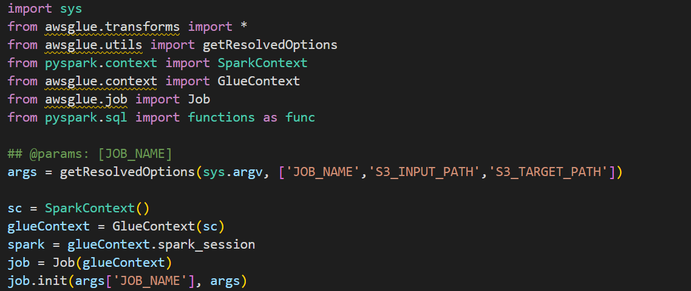

Após isso, armazenei esses caminhos nas variáveis arquivo e destino para ficar mais intuitivo e fácil de entendimento. Também fiz o carregamento do arquivo com o *spark.read.csv* e, logo após, já comecei o tratamento tratando valores nulos em certas colunas, como *notaMedia* e *genero*. 

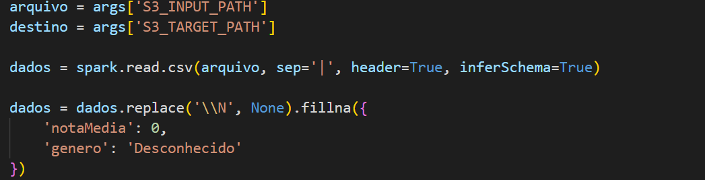

Em seguida, filtrei os dados pegando apenas os filmes do gênero Ação e Aventura, pois esse é o tema da minha Análise. Tratei as colunas *anoNascimento* e *anoFalescimento* que se encontravam no tipo string e eu queria no tipo int. Caso os valores não sejam números representados por string, ele retorna como none.

De imediato, após todas essas transformações necessárias, preparei o caminho que o arquivo ficará armazenado no bucket na variável resultado. Por fim, salvei os dados no formato parquet, como pedido no desafio, e salvei. 

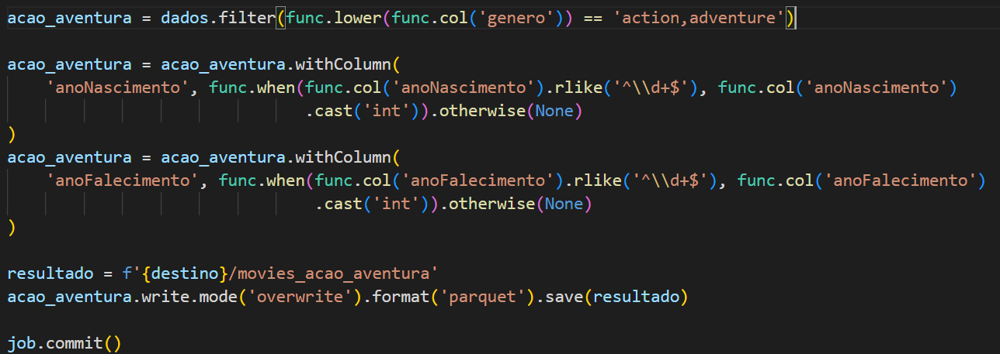

#### Crawler

Depois que criamos o job e rodamos ele, precisamos criar um banco de dados, onde o crawler irá adicionar uma tabela com os dados do S3, prontos para serem analisados com o Athena. Observação: Não precisei criar uma nova Role, pois utilizei a mesma que foi usada na Atividade de Glue da sprint passada.

1 passo: criação do banco de dados por meio do serviço Lake Formation.

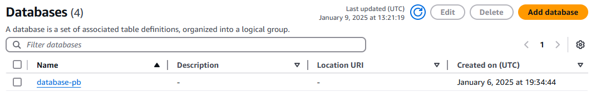

2 passo: Criação do Crawler, aqui a gente começa nomeando o crawler, adiciona o arquivo armazenado no S3 que queremos criar tabelas no banco de dados (no caso o arquivo movies_acao_aventura). Adicionamos a Role e, por fim, o banco de dados.

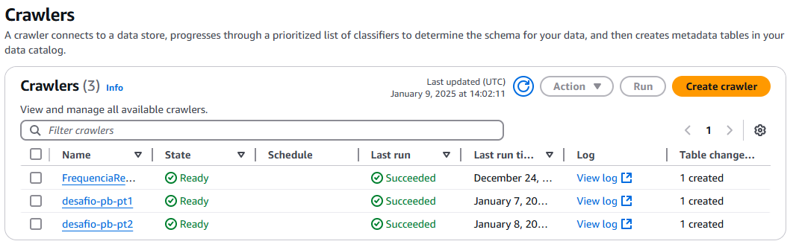

3 passo: rodar o crawler. Depois que criamos o crawler é preciso rodar ele. Se for criado uma tabela no banco de dados escolhido, deu tudo certo. 

4 passo: Com a tabela criada, basta clicar em table data e seguir para o Athena, lá você pode fazer consultas e verificar seus dados. Como o parquet não é um arquivo legível, usamos o Athena para poder analisar nossos dados de forma mais clara.

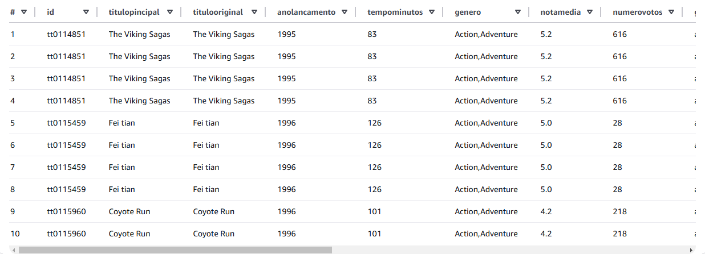

### JOB 2

Após ter feito o job 1, o único passo que mudou foi o script do job, pois os passos após isso são os mesmo.

#### Código 

Como dito acima, o Glue já dá uma base das importações e da inicialização do Spark. Então importei alguns outros módulos necessários e outros parâmetros que utilizei, como o caminho para o meu bucket e o caminho para o arquivo a ser processado. 

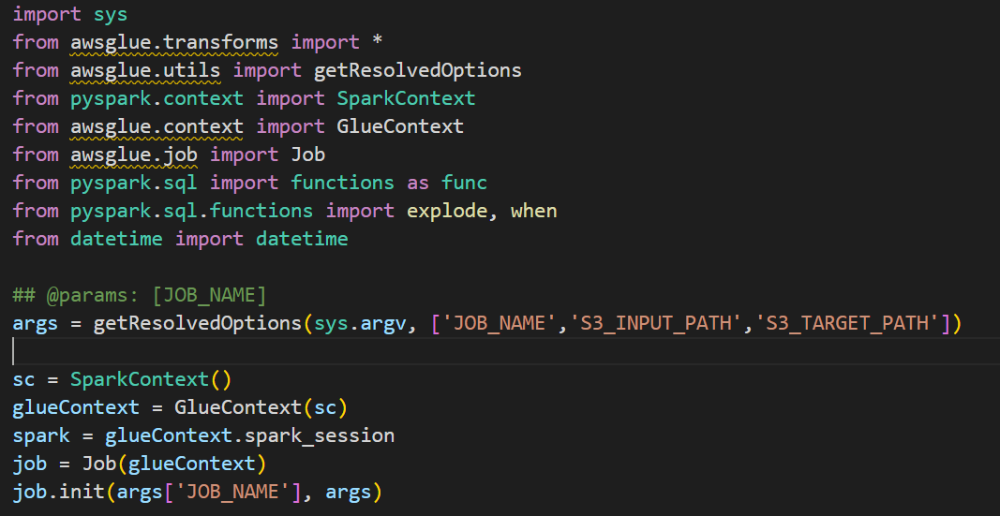

Como eu precisava escrever um caminho diferente para o arquivo (*/bucket/Trusted/parquet/data/arquivo*) ser armazenado lá no bucket, puxei a data do momento que o código seria rodado para fazer parte do caminho. Outra coisa que fiz foi armazenar os parâmetros em variáveis mais intuitivas, como arquivo e destino.

Dado esses pontos, comecei carregando os dados com *spark.read.option().json()*, utilizei o *option* pois como o meu arquivo json contem muitas linhas/registros, precisei especificar para não dar erro. 

Muitas colunas do meu arquivo contem dados dentro de array, para isso, precisei tratar retirando eles do array com a função *explode* de functions. Outra coisa que determinei foi a exclusão de duas colunas, como estou com uma análise bem consolidada, vi que as duas não servirão de uso, já exclui para evitar carregamento de dados obsoletos. 

A coluna *diretores* também é do tipo array, mas quando utilizei a função explode, ele não deu certo. Dessa forma, tive que buscar outra forma para retirar esse array. Assim, como é apenas um único item dentro desse array, usei o *getItem(0)*, pegando apenas o primeiro item da lista. 

Outra transformação que achei necessária para minha base de dados do TMDB, foi mudar o tipo da coluna *data_lancamento* de string para date, pois irei usar essa coluna para criar outra a seguir. 

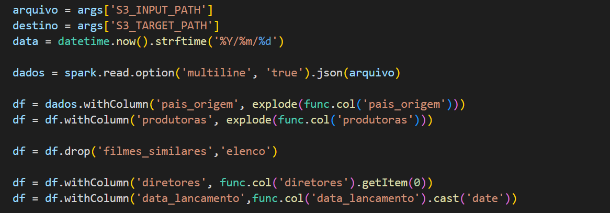

Como disse acima, criei uma outra coluna para minha análise chamada estacao. Como quero fazer um comparativo do ROI com a estação do ano em que os filmes foram lançados, precisei criar uma coluna para isso. Dessa forma, foi de suma importância modificar o tipo da coluna data_lancamento para isso.

Para conseguir fazer a separação das estações, precisei extrair da coluna data_lancamento o dia e o mes, utilizando a função *month* e *dayofmonth*. Após isso pude começar a criar a coluna estacao utilizando o when e os operadores lógicos designando as datas e as estações. 

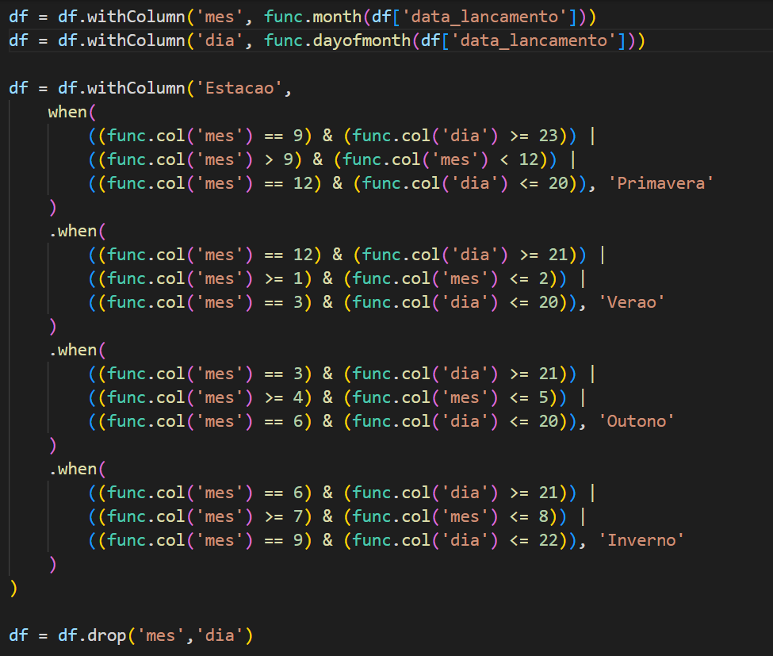

Em seguida, eu já eliminei as colunas mes e dia, pois não preciso delas no meu dataset, só iriam ocupar espaço. 

Para finalizar, armazei o caminho em resultado e salvei o arquivo no bucket do S3.

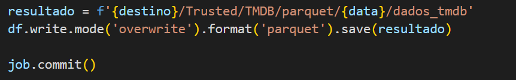

Depois de criar e rodar o job, é só fazer a mesma coisa que no Job 1, porém não precisando criar um banco de dados.

Cria e roda o Crawler.

Verifica se a tabela foi criada.

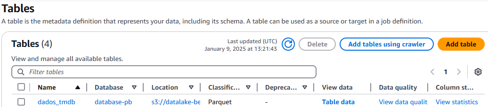

Após a tabela ser criada, é só visulizar os dados no Athena.

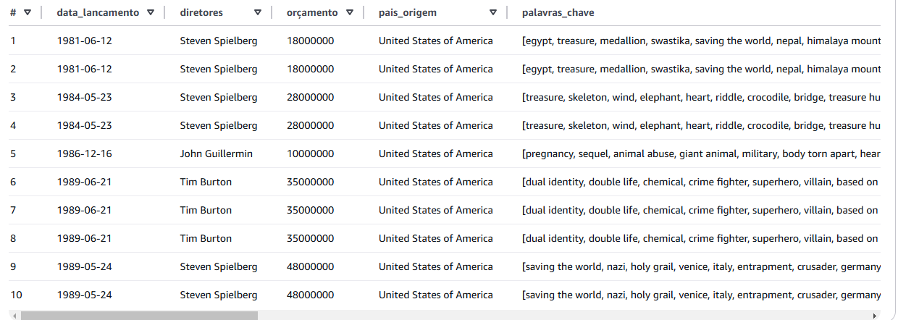

