####
**Localização**: C:\Users\beatr\OneDrive\Área de Trabalho\ProgramaBolsas\Sprint7\README.md

## Informações
* Na parte **exercícios** encontrará minhas resoluções dos exercícios.
* Indo em **evidências** você consegue entender como desenvolvi o desafio do sprint.
* Em **certificados** irá encontrar quais cursos participei e conclui.

## Anotações

Nessa sprint, pude colocar mais em prática meus aprendizados sobre o Apache Spark e os serviços da AWS, focando no processamento de dados com o Glue.

## Exercícios

Nessa Sprint focamos na entrega do desafio, não tendo exercícios. 

## Evidências

Evidência do código do job1.
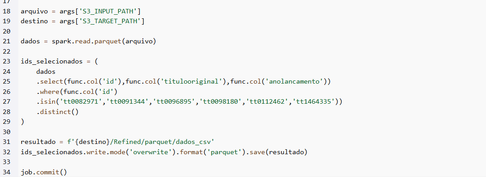

Evidência da criação da tabela do job1.

Dados do job1 no athena.

Evidência da seleção de colunas no Job2.

Evidência da criação da coluna temas a partir da coluna palavras chave.
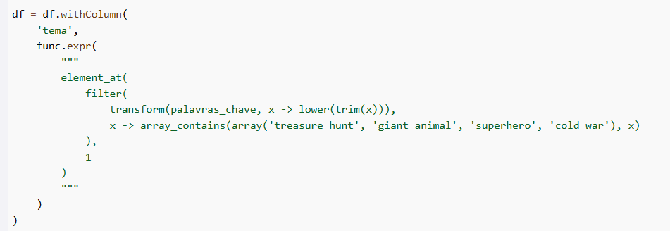

Evidência do job2 onde são feitas mudanças nas colunas, como renomeação da coluna, apagamento de algumas colunas, apagamengto de linhas duplicadas e salvamento do dataframe no S3.
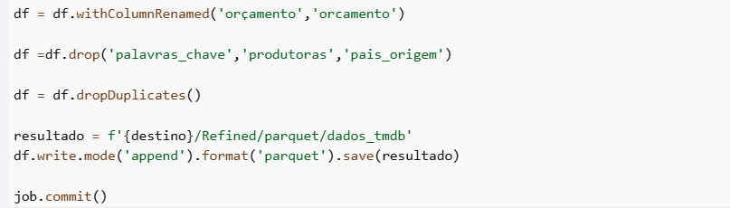

Evidência da criação da tabela do Job2.

Evidência dos dados do job2 no athena.

Evidência do job da modelagem, onde é feito o join dos dataframes, renomeação de colunas e criação da coluna id_diretor.

Evidência da criação e salvamento no S3 da tabela fato.
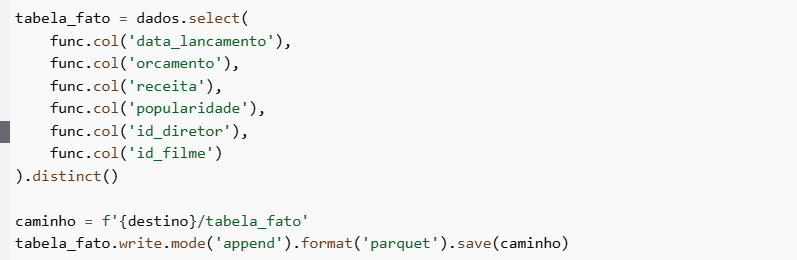

Evidência da criação e salvamento no S3 da tabela dim filme.
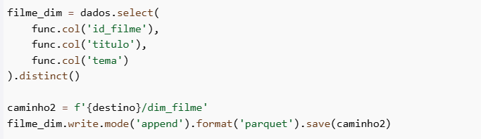

Evidência da criação e salvamento no S3 das tabelas dim diretores e dim data.

Evidência da criação das tabelas a partir dos Crawlers.
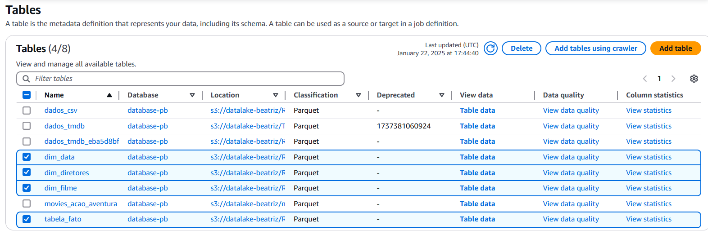

Evidências dos dados das tabelas no Athena.

Tabela dataDim.
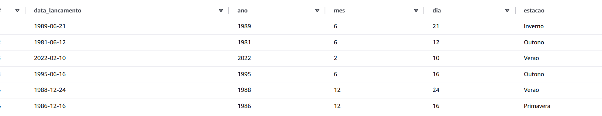

Tabela diretoresDim.
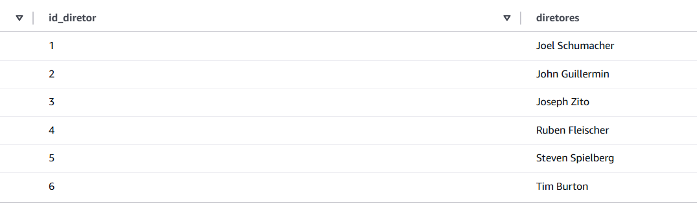

Tabela filmesDim.

Tabela fatos.
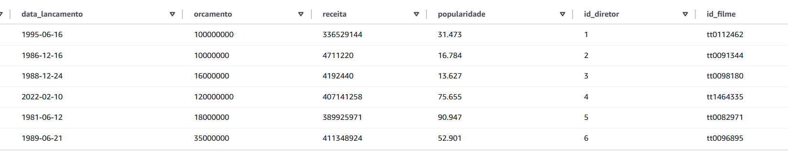

Evidência dos arquivos no bucket do S3.
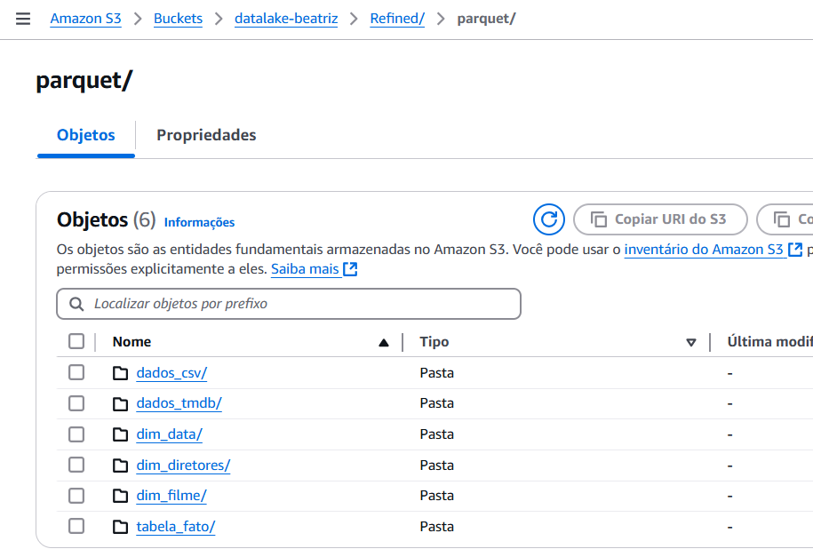

Evidência da criação da modelagem dimensional e relacional(código).

Evidência da modelagem.
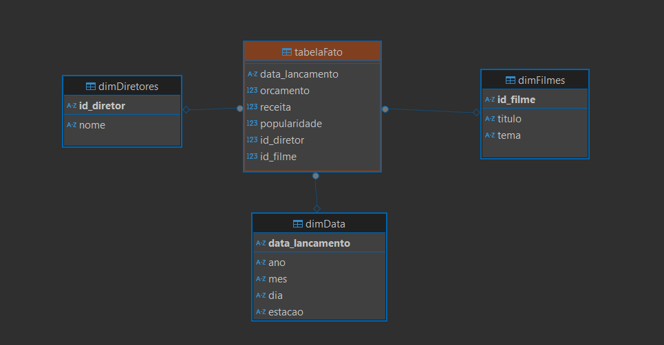

## Certificados

Nessa sprint não tivemos cursos na plataforma da AWS.