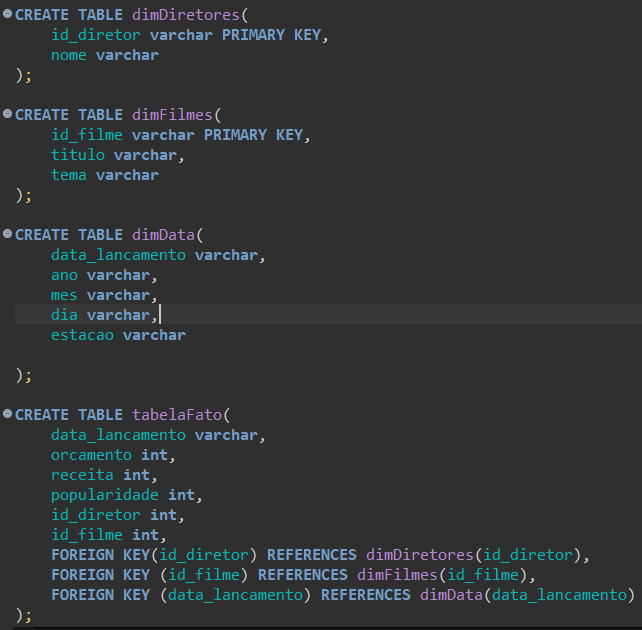

## Desafio
Aqui você encontrará o passo a passo de como solucionei o desafio da Sprint 9.

A partir da sprint 6 foi feita a entrega, por partes, do desafio final. Ou seja, o desafio final é constituído de 5 entregas. 

**Localização**: C:\Users\beatr\OneDrive\Área de Trabalho\ProgramaBolsas\Sprint9\desafio\README.md

Nessa sprint 9 tivemos a penúltima entrega do desafio final. Nessa etapa fizemos o refinamento dos dados, salvando os dados na camada Refined, deixando-os prontos para a parte final que é a análise dos dados e a criação do dashboard.

Nessa etapa eu fiz 3 jobs, pois precisava ainda lidar com alguns detalhes das minhas bases de dados. 2 jobs foram para preparar os dados e o último job foi para a criação da tabela fatos e das tabelas dimensões. 

### JOB 1 - Dados do CSV movies.

Aqui nesse job eu só fiz a seleção das colunas que irei usar na minha análise, puxei a coluna id, titulooriginal e anolancamento dos filmes que vou trabalhar, que são apenas 6. 

Depois criei o crawler para esse arquivo para criar a tabela no banco de dados e poder visualizar no Athena.

"

Dados no Athena:

### JOB 2 - Dados do TMDB.

No job 2 eu comecei selecionando apenas os dados dos filmes que eu irei utilizar na minha análise.

Após isso, comecei a criar a coluna *tema* através da coluna *palavras_chave*. Comecei criando uma lista de temas, em seguida fiz uma busca no array de palavras_chave para que caso algumas dessas palavras batessem com algum tema da lista de temas, puxasse para a coluna tema de determinado filme. 

A principal mudança foi a criação dessa nova coluna, mas eu ainda precisava fazer outras mudanças, como renomear o nome da coluna *orcamento* que estava com *ç*. Deletar algumas colunas que não irei mais usar, como palavras_chave. E por fim, caso tivesse linhas duplicadas, mandei apagar com *dropduplicates*. 

Depois criei o crawler para esse arquivo para criar a tabela no banco de dados e poder visualizar no Athena.

"

Dados no Athena:

### JOB da modelagem.

Comecei pegando os caminhos dos dados no S3 e fazendo o Join entre elas. Em seguida, renomeei algumas colunas e fiz uma nova coluna chamada *id_diretor* para utilizar na modelagem. 
Para criar a coluna *id_diretor* eu utilizei um método de ranking, onde foi ordenado os nomes dos diretores e atribuído a eles um ranking de 1 a 6. Assim eu pude especificar uma identificação única para cada um. 

Após finalizar todas as mudanças que faltavam, comecei a criar a modelagem dimensional do meu dataset. Como meus dados estão todos juntos através do join, eu só precisei ir selecionando as colunas para determinada tabela e depois salvar cada tabela em um arquivo para depois visualizar as tabelas no athena. 

Como na evidência acima, eu criei a variável tabela_fato e fiz as seleções das colunas. Após isso eu só precisei salvar o arquivo no S3.

Fiz a mesma coisa para as restantes.

Após rodar o job, os arquivos são enviados para o bucket no S3. Agora é preciso criar crawler para cada arquivo enviado. O crawler vai ser responsável em criar uma tabela no banco de dados especificado. Com a tabela criada, poderei analisar meus dados no Athena.

Tabelas criadas:

Dados no Athena para:

Tabela fato 

Tabela dimensão filme

Tabela dimensão diretor

Tabela dimensão data

Arquivos no bucket do s3:

### Modelagem Dimensional

Para finalizar, foi pedido que fizéssemos a modelagem dimensional no Dbeaver. Para isso, eu criei as tabelas e suas respectivas colunas. 
Além disso, criei chaves primárias e estrangeiras para fazer uma modelagem relacional.

Visualização da modelagem dos meus dados: 

